# pi-web

**The best interface for working with your agents.**

[Website](https://ashwin-pc.github.io/pi-web/) · [Getting started](https://ashwin-pc.github.io/pi-web/getting-started/) · [Extensions](https://ashwin-pc.github.io/pi-web/extensions/)

pi-web is a focused browser workspace for substantial, inspectable agent work across mobile, desktop, and tablet. [`pi`](https://www.npmjs.com/package/@earendil-works/pi-coding-agent) is its current default and full-capability reference harness; the architecture is being designed to support additional harnesses without reducing what pi can do.

It keeps the surrounding work visible—sessions, rich artifacts, files, diagrams, tool output, diffs, and extension-built workflow UI—without trying to become a full IDE.

| Desktop | Mobile |
| --- | --- |
| 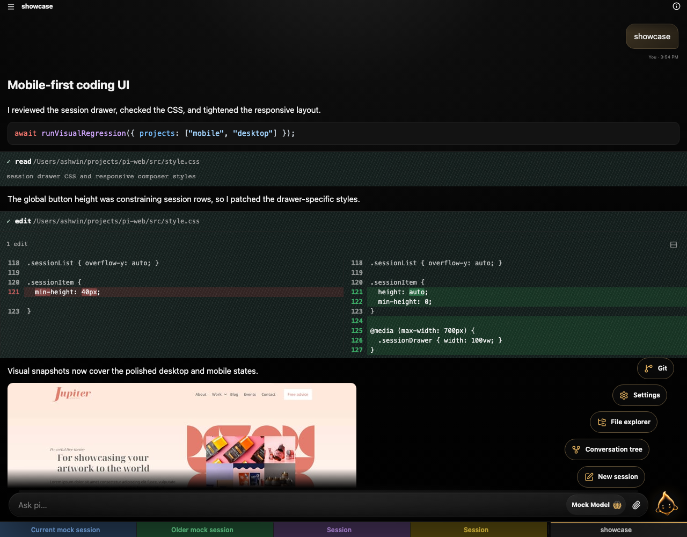 | 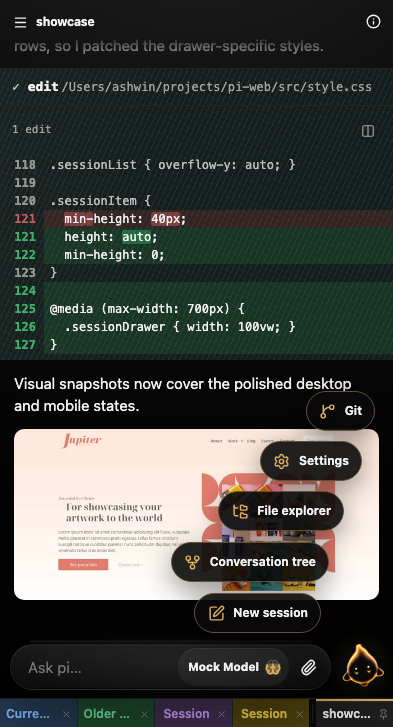 |

## Why pi-web?

- Every-device UI: a responsive experience for phone, tablet, and desktop browsers
- Minimal by design: a focused agent UI, not a full IDE replacement
- Self-aware: pi-web injects web UI context so sessions understand artifacts, images, restarts, and browser-specific behavior
- Code-review friendly: inspect tool output, edits, Git status, commits, and diffs
- Session-oriented: organize ongoing work with reorderable pinned tabs, drawers, colors, filters, metadata, and conversation navigation
- Rich output: preview artifacts and open Mermaid diagrams in a full-screen viewer

## What changed in 0.5.0?

0.5.0 expands the session workspace and improves everyday interaction across devices:

- reorder pinned session tabs and assign colors directly from the tab menu
- inspect session metadata and use new artifact actions
- open Mermaid diagrams in a dedicated full-screen viewer
- see queued steering and follow-up messages before they are sent
- use the improved model picker and tighter mobile folder selector
- recover more easily from connection warnings and session switches
- benefit from more reliable conversation-tree layouts and updated Pi 0.82.0 runtime support

See the [0.5.0 release notes](docs/releases/0.5.0.md) for the fuller changelog.

## Install

For development:

```bash
npm install
```

pi-web currently works through a local, authenticated [`pi`](https://www.npmjs.com/package/@earendil-works/pi-coding-agent) installation. Prepare the harness first:

```bash
npm install -g @earendil-works/pi-coding-agent
pi
```

Run `/login` inside pi, complete provider authentication, then exit pi. Authentication belongs to the harness rather than pi-web. As support for additional harnesses arrives, the boundary remains the same: install and sign in to the harness locally before using it through pi-web.

Then install and run pi-web from npm:

```bash
npm i -g @ashwin-pc/pi-web
pi-web
```

Or run pi-web without a global install:

```bash
npx -y @ashwin-pc/pi-web@latest
```

From a GitHub release asset:

```bash
# Download pi-web-<version>.tgz from the release page, then:
npm install -g ./pi-web-*.tgz
pi-web
```

`pi-web` starts the production server on `http://127.0.0.1:8787` by default. It runs Pi in the directory where you call the command; override with `PI_WEB_CWD=/path/to/project pi-web`.

## Run locally with Vite HMR

```bash
npm run dev
```

This starts a stable TypeScript supervisor on `8787` and a restartable child server on `8788`. The public URL still serves:

- Vite frontend with HMR
- Pi API routes under `/api/*`
- Pi WebSocket at `/ws`

The supervisor also exposes:

- `POST /api/restart` - restart the child server safely
- `GET /__supervisor/status` - inspect child PID/generation

Open:

```text
http://127.0.0.1:8787
```

Edit files under `src/` and Vite will update the UI live. If the agent edits `server.ts`, call `POST /api/restart` instead of killing the public server; the supervisor stays alive and the browser reconnects.

By default, Pi operates in the directory where you start this server. To point Pi at another project:

```bash
PI_WEB_CWD=/Users/ashwin/projects/comfy-lan-webapp npm run dev
```

## Core features

### Mobile-first sessions

The session UI is built for small screens first, then scales up to desktop. Session lanes keep active work **Pinned**, paused work **Parked**, and useful references in **Bookmarks**. The dedicated lane drawer supports notes, bucket markers, stale parked-session badges, and drag-and-drop ordering within or across lanes, while pinned sessions remain immediately available in the tab bar.

Right-click a session—or long-press it on touch devices—to open the Inspector Card and change its lane, bucket, or optional note. Keyboard shortcuts cover pinning (`Ctrl/Cmd+Shift+P`), parking (`Ctrl/Cmd+Shift+K`), bookmarking (`Ctrl/Cmd+Shift+B`), and cycling through the focused lane (`Ctrl/Cmd+Shift+←/→`).

### Workspace Explorer

The responsive Explorer opens the active session's working directory as a lazy-loaded file tree and a full CodeMirror editor. A dedicated Artifacts scope presents generated project output as a visual gallery, with large interactive previews for images, sandboxed HTML, rendered Markdown, video, and PDFs—without digging through Pi's internal storage folders. Workspace and Artifacts each preserve their folder, scroll, and preview state when switching views or reopening the panel. Browser Back returns an open file or artifact to its prior tree or gallery before closing the panel on the next step. The Explorer supports syntax highlighting, multiple closeable tabs, conflict-aware saves, search and editor shortcuts, line wrapping, pinch or slider font resizing, and a resizable or collapsible tree. Desktop keeps chat, tree, and editor visible together; phones and touch-first foldables switch cleanly between the tree and editor without summoning the keyboard until the editor is tapped.

File access stays scoped to the session working directory. The server rejects path traversal and escaping symlinks, detects binary and oversized files, writes atomically, and uses revisions to prevent silently overwriting changes made elsewhere.

### Diffs and tool review

A shared diff viewer supports side-by-side or stacked layouts with intraline highlighting. It is used by both edit tool cards and Git diffs, so code review feels consistent across agent changes and repository history.

### Git status, graph, and commit diffs

The Git button in the header opens a responsive Git panel for repo status, commit history, per-file diffs, per-commit diffs, and sync with `fetch` + rebase pull.

### Self-aware pi context

`contexts/web-ui.md` is injected into agent sessions so pi understands pi-web behavior such as artifact links, image rendering, and supervised restarts. Bundled pi extensions add pi-web defaults, including automatic session naming from the first prompt.

### pi-web extensions

pi-web supports browser-specific extensions in `.pi/web/extensions` and `~/.pi/web/extensions`. These use pi's extension runtime with a typed pi-web UI API, including `ctx.ui.web.setFooter(...)` for rendering text or trusted HTML between the composer and pinned session tabs.

See [pi-web extensions](docs/pi-web-extensions.md) for locations, types, and examples, including the live git footer in [`examples/pi-web-extensions/git-footer.ts`](examples/pi-web-extensions/git-footer.ts).

## Screenshots

The README references the same deterministic Playwright visual snapshots used by `tests/e2e/visual.spec.ts`. Desktop and mobile captures are shown side by side, and when visual snapshots are intentionally updated, these images update with them.

### New session

New sessions open with a lightweight animated empty state and a compact working-directory control. The visual baseline waits for the animation’s settled final frame so screenshot comparisons stay deterministic.

| Desktop | Mobile |
| --- | --- |
| 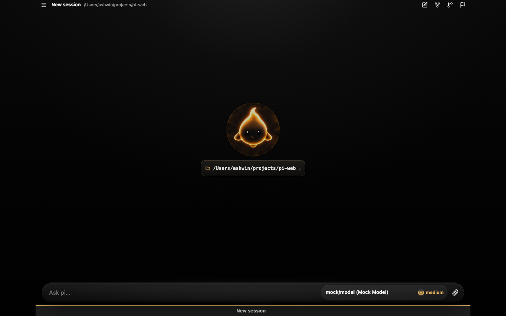 | 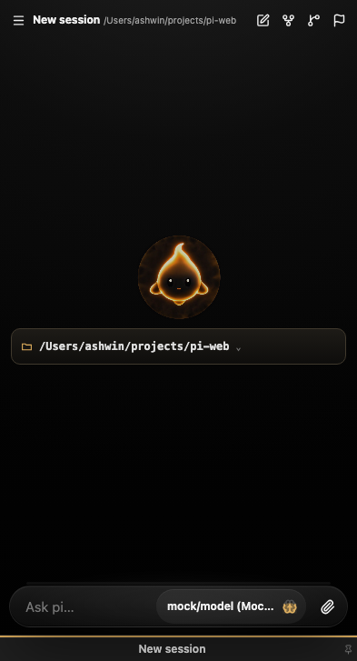 |

### Workspace Explorer

The Explorer uses the same session-scoped file tree and CodeMirror editor on every device. Desktop keeps the conversation and workspace side by side, while mobile switches to a focused editor view with a compact back control and touch-safe keyboard behavior.

| Desktop | Mobile |
| --- | --- |
| 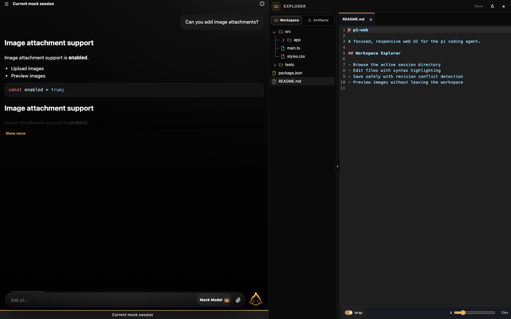 | 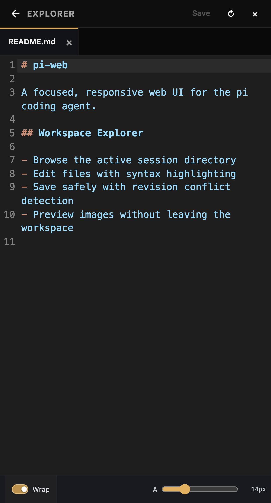 |

### Diff review

| Desktop | Mobile |
| --- | --- |
| 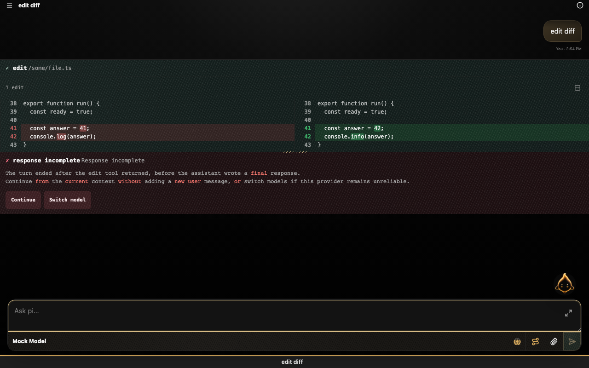 | 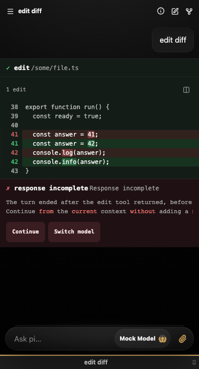 |

### Session lanes

Pinned, Parked, and Bookmarks form a persistent session workspace. The same lane manager becomes a desktop drawer or mobile bottom sheet, with flat session rows, optional notes, bucket markers, timestamps, drag handles, and quick access to the Inspector Card.

| Desktop | Mobile |
| --- | --- |
| 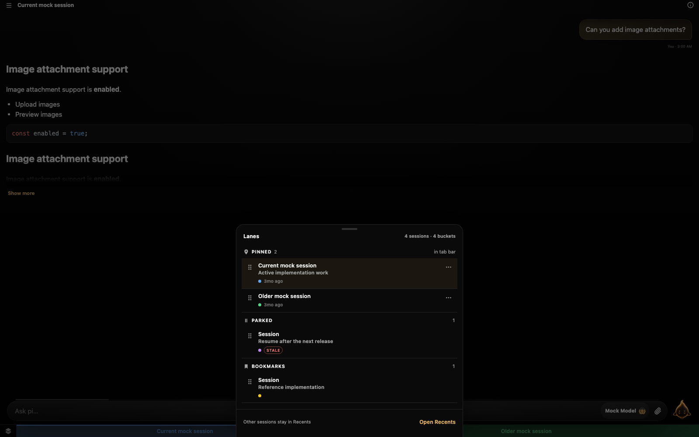 | 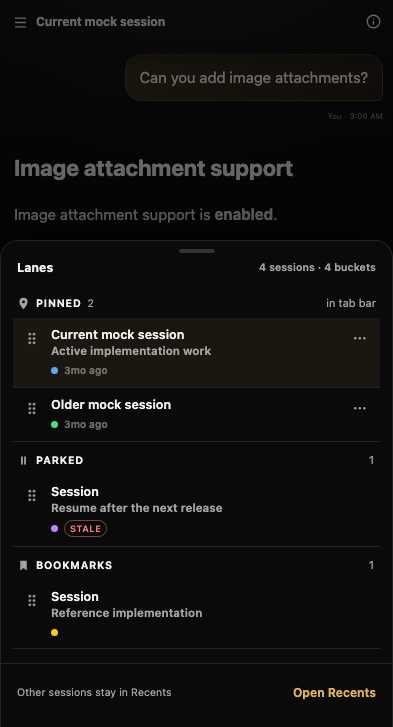 |

### Git panel

Desktop uses a split master/detail layout; mobile switches between status, graph, diff, and commit detail views.

| Desktop | Mobile |
| --- | --- |
| 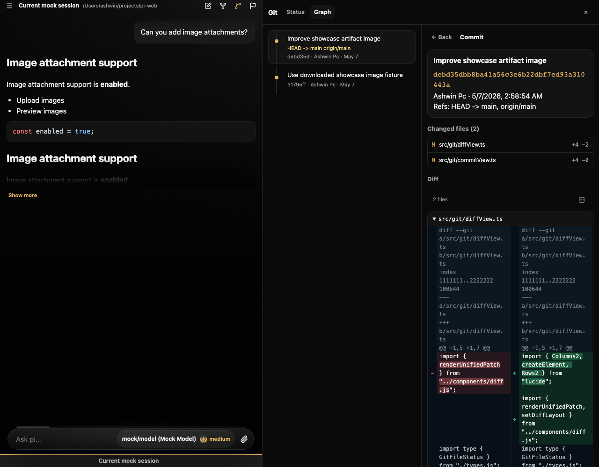 | 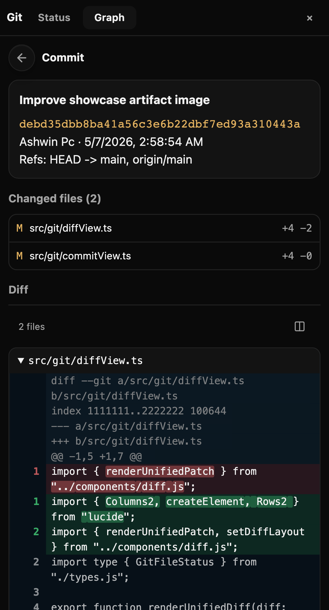 |

### Conversation tree

Navigate even elaborate, nested pi session branches with a compact tree drawer. Alternate paths stay grouped beside their fork, globally packed graph lanes keep nested branch fans from colliding, and the highlighted current path remains easy to follow. The default view keeps tool noise hidden, while the full session structure remains available from the filter.

| Nested branches · Desktop | Nested branches · Mobile |
| --- | --- |
| 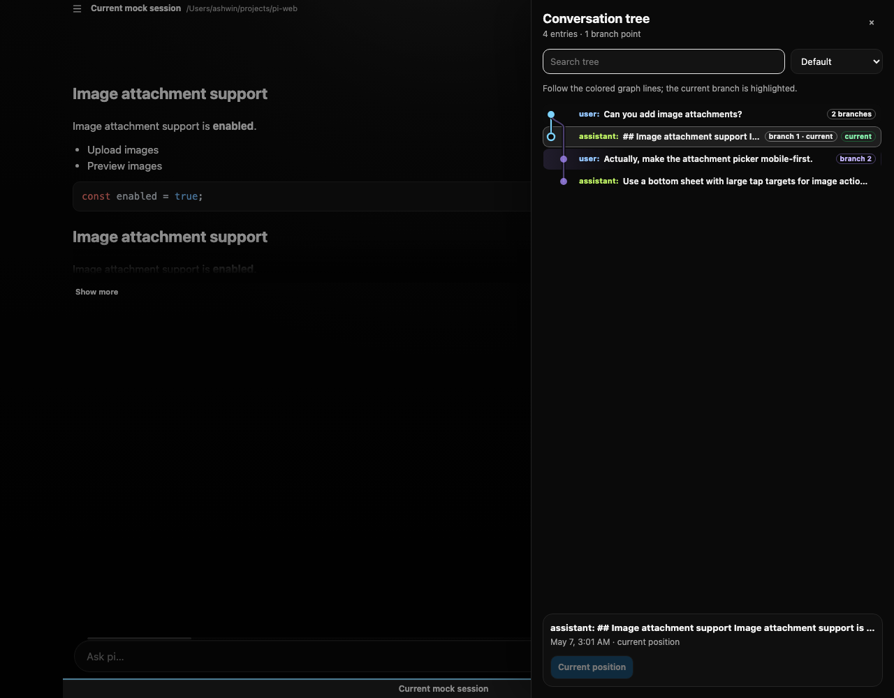 | 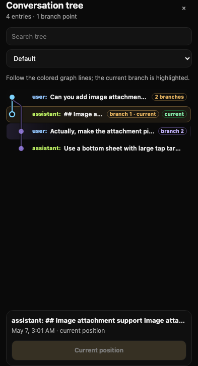 |

## Production build

```bash
npm run build
npm start
```

`npm start` serves the compiled `dist/` app and API from one process.

## Remote access

pi-web binds to localhost by default. If you want remote access, place it behind a secure networking or reverse-proxy solution of your choice and set `PI_WEB_TOKEN`.

For example, with Tailscale Serve you can keep the Node app localhost-only:

```bash
npm run build
PI_WEB_TOKEN="$(openssl rand -hex 32)" \
PI_WEB_CWD=/Users/ashwin/projects/comfy-lan-webapp \
HOST=127.0.0.1 \
PORT=8787 \
npm start
```

In another terminal:

```bash
tailscale serve --bg http://127.0.0.1:8787
```

Then open:

```text
https://<machine-name>.<tailnet>.ts.net
```

Enter `PI_WEB_TOKEN` on the token screen, or use **Scan QR** if another signed-in pi-web tab is showing the Settings → Token sharing QR code.

### Direct Tailnet bind

You can also bind directly to your Tailscale IP:

```bash
PI_WEB_TOKEN="$(openssl rand -hex 32)" \
HOST="$(tailscale ip -4)" \
PORT=8787 \
npm start
```

Then open:

```text
http://<machine-name>:8787
```

## Environment variables

- `HOST` - bind host, default `127.0.0.1`
- `PORT` - bind port, default `8787`
- `PI_WEB_TOKEN` - optional bearer token for API/WebSocket access
- `PI_WEB_CWD` - project directory Pi should operate in, default current directory
- `PI_WEB_NO_SESSION=1` - use in-memory sessions only
- `PI_WEB_CHILD_HOST` - supervised child bind host, default `127.0.0.1`
- `PI_WEB_CHILD_PORT` - supervised child port, default `PORT + 1` (for example `8788` when `PORT=8787`)
- `PI_WEB_RESTART_GRACE_MS` - delay between child stop/start, default `250`

## Development architecture

The app is TypeScript end-to-end:

- `supervisor.ts` is a small stable dev supervisor that owns the public port and restarts the app server safely
- `server.ts` is the restartable Pi API/WebSocket server, run directly with `tsx`
- `src/main.ts` bootstraps the modular Vite frontend with HMR; see [docs/frontend-architecture.md](docs/frontend-architecture.md)
- in dev, `server.ts` embeds Vite middleware while `supervisor.ts` proxies API, WebSocket, and HMR traffic
- `AGENTS.md` provides normal project-specific pi instructions when the target cwd is this repo

## Security

This app can drive Pi tools such as `bash`, `write`, and `edit`. Restrict network access with your chosen security controls and set `PI_WEB_TOKEN`.
