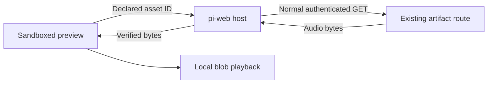

# Artifact preview assets and appearance

Registered `artifact-preview` renderers can use a small, read-only host bridge for authenticated local audio and pi-web's appearance tokens. This extends the existing [preview contribution API](pi-web-extensions.md#artifact-preview-renderer-api); it does not create another extension runtime or authentication scheme.

The iframe remains `sandbox="allow-scripts"`, without `allow-same-origin`. The parent page—not the iframe—performs ordinary authenticated artifact requests. No login credentials, filesystem paths, bearer URLs, file grants, arbitrary fetch facility, or mutation methods are passed to the iframe.

## Declare assets server-side

```ts
ctx.ui.web.contribute("example.music", {
  slot: "artifact-preview",
  kind: "rendered",
  title: "Music",
  match: { kinds: ["file"], extensions: [".song"] },
  async render(event) {
    // Resolve the song's native references using your own validated loader.
    return {
      html: await renderSongDocument(event?.context),
      assets: [{
        id: "take-1",
        path: "music/takes/first.wav",
        // Optional declarations are checked against the real file by core.
        mediaType: "audio/wav",
      }],
    };
  },
});
```

The added result field is `assets?: PiWebArtifactPreviewAsset[]`. Each descriptor has:

| Field | Meaning |
| --- | --- |
| `id` | Renderer-local identity, 1–80 characters: starts alphanumeric, followed by alphanumerics, `.`, `_`, or `-` |
| `path` | Artifact-relative path, `/api/artifacts/...`, or an artifact URL scoped to this same agent session |
| `mediaType?` | Expected supported audio MIME type |
| `bytes?` | Expected exact file length |
| `sha256?` | Expected SHA-256 digest |

Core resolves files under the **owning session's** `.pi/web/artifacts` directory, checks containment and regular-file status, and verifies optional declarations. It returns canonical metadata and owning-session artifact URLs to the parent, preventing collisions with identically named files in other workspaces. The iframe receives only IDs, media types, and lengths.

Bounds:

- Existing HTML limit: **1 MB**.
- Asset count: **128** maximum; asset metadata: **64 KiB** maximum.
- File size: **128 MiB** maximum per asset.
- Supported files: `.wav`, `.mp3`, `.flac`, `.opus` with the corresponding core MIME types.
- No external URLs, other-session references, query strings, fragments, traversal, or encoded separators.

Hashing is sequential and streaming, with size/mutation checks. Static symlink escapes are rejected and detectable replacement races fail closed. These checks are not an OS filesystem sandbox against another privileged local process continuously replacing path components; installed extensions and their local runtimes already execute with the user's permissions.

HTML-only renderers remain valid. Older hosts can be detected with:

```ts
const supportsAssets = ctx.ui.web.capabilities.artifactPreview?.assets === true;
const supportsTheme = ctx.ui.web.capabilities.artifactPreview?.theme === true;
```

## Use audio inside the iframe

Before renderer scripts execute, core installs `window.piWebPreview`:

```ts
interface PreviewBridge {
  readonly version: 1;
  readonly hosted: true;
  readonly assets: readonly { id: string; mediaType: string; bytes: number }[];
  loadAsset(id: string, options?: { signal?: AbortSignal }): Promise<Blob>;
  readonly theme: {
    tokens: Record<string, string>;
    colorScheme: "light" | "dark";
    density: "comfortable" | "compact" | "minimal";
  };
  onThemeChange(callback: (theme: PreviewBridge["theme"]) => void): () => void;
  onDispose(callback: () => void): () => void;
}
```

Example renderer script, using explicit loading followed by normal native playback controls:

```js
const bridge = window.piWebPreview;
const audio = document.querySelector("audio");
const loadButton = document.querySelector("#load");
const abort = new AbortController();
let objectUrl;

loadButton.addEventListener("click", async () => {
  if (!bridge) {
    document.querySelector("#status").textContent = "Reopen in a supported pi-web host.";
    return;
  }
  loadButton.disabled = true;
  try {
    const blob = await bridge.loadAsset("take-1", { signal: abort.signal });
    if (objectUrl) URL.revokeObjectURL(objectUrl);
    objectUrl = URL.createObjectURL(blob); // Created in THIS opaque iframe.
    audio.src = objectUrl;
    audio.controls = true;
    audio.load();
    document.querySelector("#status").textContent = "Ready. Press play.";
  } catch (error) {
    document.querySelector("#status").textContent = `Could not load audio: ${error.message}`;
  } finally {
    loadButton.disabled = false;
  }
});

addEventListener("pagehide", () => {
  abort.abort();
  audio.pause();
  if (objectUrl) URL.revokeObjectURL(objectUrl);
});
```

Create blob URLs **inside the iframe**. A parent-created blob URL is not a reliable cross-origin delivery mechanism for an opaque child. The caller owns its URLs and should revoke them when replacing sources or closing the document—not immediately after metadata has loaded.

Loading is lazy. The host queues bounded requests, applies its normal authentication, rejects redirects, checks MIME, bytes, and SHA-256, and delivers audio bytes only to the originating frame. The browser client resolves those bytes as a Blob. Per-mount channels and `event.source` checks prevent another iframe from impersonating the requester; the allowed IDs cannot be widened into arbitrary URLs or headers.



### Playback and lifecycle limits

- The complete selected asset is buffered before playback. Seeking then works locally; this is not HTTP Range streaming inside the iframe.
- Integrity verification uses Web Crypto: open pi-web through HTTPS or localhost. Insecure non-loopback HTTP cannot use this bridge; the renderer should offer an ordinary host-player fallback.
- Native playback and WebAudio remain subject to browser user-gesture rules. Do not promise autoplay after an asynchronous download.
- The host bounds concurrent work and aggregate in-flight bytes, cancels stale work, and imposes an asset-request deadline. Extensions should also cancel superseded requests using `AbortSignal`.
- Register deterministic cleanup with `onDispose(callback)`. The callback runs at most once when the host disposes the mount, before bridge subscriptions are cleared. One callback throwing does not prevent the others. The returned function unregisters it. Registering after disposal invokes the callback immediately (with exceptions isolated) and returns a no-op unsubscribe.
- After disposal, theme and viewport callbacks stop, pending bridge requests reject, and new requests reject. Treat `pagehide` as a standalone-document fallback rather than the hosted cleanup contract.
- Every network request uses existing authentication. A fresh request after authentication expires is denied normally. Bytes already delivered to the browser cannot be retroactively revoked, just like an ordinary completed download.
- This bridge is only for registered custom artifact previews. Arbitrary uploaded HTML does not receive these privileges.
- There is no automatic artifact invalidation or inline/expanded playback handoff. Mounted previews remain snapshots until reopened.

## Request a host-reviewed composer addition

A registered preview may declare an explicit interaction action allow-list and a
server-side handler. On supporting hosts, sandbox code can call
`window.piWebPreview.requestReview({ action, payload })`. The payload is bounded
JSON and the action must be declared by the active renderer registration.

The iframe's claimed gesture is **not trusted**. A request only opens a
host-owned Review dialog. Nothing changes until the user clicks **Add to chat**
in that parent-page dialog; Cancel changes nothing. Approval invokes the
server-side handler a second time and requires its normalized proposal to match
the reviewed proposal exactly. Session, draft revision/selection, preview mount,
and renderer registration must also still match. A failure returns `stale` and
applies nothing.

```ts
const outcome = await window.piWebPreview.requestReview({
  action: "review-source-edit",
  payload: { selection: { start: 12, end: 30 }, comment: "Simplify this." },
});
// outcome.status: added | cancelled | stale | unsupported
```

The handler returns either `stale`, `unsupported`, or a review containing exactly
one append-only `insert-composer-text` (`placement: "end"`) and one
`add-composer-context` effect. Review responses reject unknown fields at every
schema level. Core supports a
generic `type: "reference"`, `provider: "artifact"` context with an
artifact-relative path, SHA-256, optional human-readable snapshot identity, and
bounded UTF-16 source ranges. Format-specific revision, selection, validation,
and rebasing semantics remain extension-owned.

Confirmed effects reuse the ordinary composer insertion and removable-context
pipeline, preserve the existing draft/files/quotes/other contexts, and never
submit a prompt or mutate the artifact. Context identity collisions fail closed
unless the existing reference is structurally identical, and context changes
while review is open make it stale. Selection/cursor replacement remains available
to the separate capture API but is deliberately outside review v1. Context pills are currently session-memory
state, matching existing extension references; the inserted text should therefore
contain a complete human-readable source locator so an unsubmitted draft remains
meaningful after refresh.

The bridge keeps the iframe at `sandbox="allow-scripts"`. It exposes no session
or registration IDs, artifact path, credentials, URLs, headers, arbitrary fetch,
parent DOM access, prompt execution, or artifact mutation method. Payloads are
bounded by UTF-8 encoded bytes (32 KiB), structural depth, and value count before
full serialization where possible. One review may be pending per mount, with a
small global pending limit and timeout. Artifact contexts are resolved against
the invoking session's artifact root and canonicalized to the owning session URL;
foreign-session and non-canonical paths fail closed.

## Read the actually visible iframe viewport

Supporting hosts expose `artifactPreview.viewport` capability and a read-only
`window.piWebPreview.viewport` snapshot:

```ts
const current = window.piWebPreview.viewport;
const unsubscribe = window.piWebPreview.onViewportChange((viewport) => {
  // width/height are the iframe content viewport. visible edges are local CSS px.
  positionTransientControlsAbove(viewport.visible.bottom);
});
```

The shape is `{ width, height, visible: { left, top, right, bottom } }`. Values
are finite, non-negative iframe-local CSS pixels. An initial or fully clipped
frame has a zero visible rectangle. This lets responsive previews account for
host clipping and the visual viewport without hard-coded composer/footer sizes.
Older hosts omit the capability, so previews must retain a standalone fallback.

Core derives clipping from a native `IntersectionObserver`, accounts for iframe
borders and host scaling, and conservatively subtracts host-declared occlusion
rectangles (such as composer attachment chips that overhang the transcript) only
for previews in the owning host surface. Side-panel previews are unaffected by
unrelated composer chrome. Occluders are observed for size/visibility changes.
Core requests a fresh observation after coalesced host scroll, visual-viewport,
ancestor, and occluder resize changes rather than rescaling stale intersection
data. Updates stop when the mount detaches, changes session or
renderer registration, or is disposed. The parent message listener and appearance
observer exist only while at least one registered preview is mounted; disposing the
last mount also cancels its queued viewport refresh and disconnects shared observation. The child receives geometry only—never
parent DOM handles, selectors, paths, URLs, credentials, or mutation access.

## Inherit the host appearance

Core supplies these CSS custom properties in the iframe and updates them in place:

```css
--pi-web-bg
--pi-web-panel
--pi-web-panel-2
--pi-web-border
--pi-web-text
--pi-web-muted
--pi-web-accent
--pi-web-danger
--pi-web-font-family
--pi-web-font-size
```

Use them with neutral fallbacks for standalone documents:

```css
html, body { margin: 0; padding: 0; }
body {
  color: var(--pi-web-text, #f2f2f2);
  background: transparent;
  font-family: var(--pi-web-font-family, system-ui);
  font-size: var(--pi-web-font-size, 15px);
}
button { color: var(--pi-web-text); background: var(--pi-web-panel-2); }
.current-note { color: var(--pi-web-accent); }
```

The host artifact card owns the outer border, radius, identity controls, and framing. Render content edge-to-edge rather than adding another padded card inside it. Keep only the internal spacing and separators necessary for the content itself.

`onThemeChange` is available when a canvas or other non-CSS visualization needs redraw notification. CSS-only consumers can use the variables directly. Theme updates do not remount the iframe or restart audio. Theme data is a bounded token whitelist, not access to the host DOM, storage, settings mutation, or arbitrary stylesheets.
