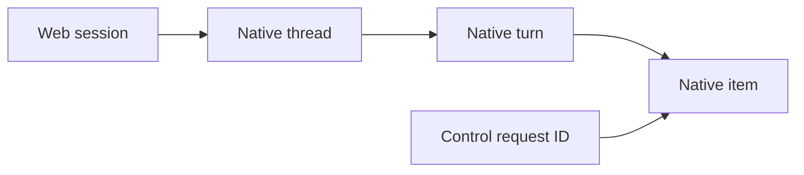

# Native Codex integration

Codex uses its documented **app-server JSONL API**, through the installed `codex` command on PATH. Native configuration, credentials, tools, instruction loading, approvals reviewer and sandbox enforcement remain Codex's responsibility. The adapter must not replace them with Pi defaults, exported credentials or an alternate command executor.

This document records the native contract, setup and compatibility evidence for issue #92. Protocol/unit evidence is not a claim of a completed browser workflow or an actual-model canary.

## Protocol pin and setup

| Component | Audited value |
|---|---|
| Native binary/protocol | `codex-cli 0.154.0` |
| Managed wrapper on the audit machine | Toolbox `0.154.0.469 (stable)` |
| Actual model provider | Amazon Bedrock, managed credentials |
| Checked-in exact generated schema | [`tests/fixtures/codex-0.154.0/schema.json`](../tests/fixtures/codex-0.154.0/schema.json) |
| Schema hash, regeneration command and source reference | [`pin.json`](../tests/fixtures/codex-0.154.0/pin.json) |
| Primary API documentation | <https://developers.openai.com/codex/app-server.md> |
| Pinned primary source | <https://github.com/openai/codex/tree/6b9826e3aa83b1a5947db50f4332cb9c65f1b340/codex-rs/app-server> |

Check setup without submitting a model request:

```sh
command -v codex
codex --version
codex app-server --help
codex app-server generate-json-schema --experimental --out /tmp/codex-schema
```

The exact installed schema is authoritative when current online documentation differs. On the audit machine, PATH `codex` is a Toolbox shim invoking its managed wrapper and bundled native executable. The wrapper's `codex login status` says login is **not required** because Bedrock credentials are managed; that response is not a missing-login blocker.

Do not override `HOME`/`CODEX_HOME` for a real-wrapper canary: a disposable HOME can prevent Toolbox association resolution, which is a setup-isolation error, not evidence that Codex is missing. Direct invocation of a pinned native binary is acceptable for credential-free version/schema/protocol-syntax checks, but is **not** equivalent to validating the production wrapper/authentication path.

Isolate pi-web metadata instead: use a scratch `PI_CODING_AGENT_DIR`, `PI_WEB_AUTH_STORE`, `PI_WEB_SESSION_UI_STATE_FILE` and the service's Codex registry path; keep native environment/credentials server-side. Use a scratch cwd or private worktree. No credential copying or login changes are needed.

## Native settings are authoritative

The metadata-only real-wrapper probe used only `{cwd, ephemeral:true}` on `thread/start`. It observed:

- provider `amazon-bedrock`, model `openai.gpt-5.6-sol`;
- effective reasoning effort **medium**, although `model/list` suggested **low**;
- approval policy `on-request`, reviewer `auto_review`;
- read-only sandbox with network access disabled.

Production start/resume/prompt requests omit model, effort, policy, reviewer, sandbox and instruction overrides. Display returned effective settings; never apply catalog defaults automatically. Experimental API negotiation is used only for native approval bounds (`availableDecisions` and permission detail), not to enable alternate tools, grant permissions or expose every protocol endpoint.

## Identity, acceptance and lifecycle

Web session identity is distinct from every native identity. A native path is nullable, unstable and never a Pi `sessionFile`.



`turn/start` returns the native accepted turn, not proof of completion. Native Codex can use `turn/start` to steer an already active turn, so the adapter must admit new prompts deliberately and use `turn/steer {expectedTurnId}` for explicit active-turn steering. Native request timeout is ambiguous; automatically resending a prompt could execute it twice.

`turn/interrupt` must target the exact nonempty native turn ID. The installed native implementation rejects stale/no-active targets and acknowledges a normal interrupt only after its abort event. An empty native turn ID has special startup-cancellation semantics and is not a UI wildcard.

Thread activity is independent of item/turn completion. Native thread status distinguishes idle, active (including waiting on approval/user input), not loaded and system error. Native errors can carry `willRetry`; an error or an assistant final-answer item must not falsely mark a session settled.

## Persistence and recovery

| Native session state | Honest behavior |
|---|---|
| Live ephemeral thread | Reuse the owned handle. Metadata-only `thread/read` works; stored `thread/list` omits it. |
| Ephemeral thread after owned process loss | Explicitly unavailable/expired; web metadata may be removed. Never call resume or manufacture durable history. |
| Persistent but never prompted | Native storage may not yet be materialized. Even a non-null start path does not prove resumability. Native resume can fail with `no rollout`. |
| Materialized persistent thread | Resume by native thread ID and hydrate native history through public operations. No native JSONL/SQLite parsing. |
| Process died after ambiguous dispatch | Mark interrupted connectivity/recovery state, not successful completion. Resume authoritative history; do not replay the prompt. |

A surviving native server can replay outstanding approval requests when a client rejoins. Deduplicate those by exact native request identity. No exactly-once/replay cursor guarantee has been established for incremental text; terminal native items and resumed history are authoritative.

## Approval safety

Command approvals distinguish **allow once**, **allow for this session**, **decline action** and **stop turn**. Only offered and implemented choices are exposed. Decline rejects the action but lets Codex continue; cancel maps to native abort. Persistent exec/network-policy amendments are deferred rather than interpreted by pi-web.

File approvals require the correlated native file-change item so the UI identifies the affected paths. The native schema marks `grantRoot` unstable, so broader file-session grants are not offered initially. Permission requests are different: a user may approve the exact validated requested profile for the native **turn** or **session**, or grant nothing; the browser cannot supply replacement permission JSON.

Responses are validated against the outstanding request and its thread/turn/process identity. Duplicate, foreign-session, resolved, expired or previous-process replies cannot grant anything. `serverRequest/resolved` removes stale dialogs. Known deferred controls receive documented no-grant responses; unknown required controls receive an explicit native error and safe execution cleanup, not silence or fabricated approval.

Unknown informational variants are tolerated separately. Retain only bounded/redacted observations (method/shape/known IDs/size), never arbitrary credential-bearing native envelopes in browser persistence. Do not discard already accumulated text when an additive native variant appears.

## Compatibility matrix

These classifications distinguish native availability from the first adapter surface. Existing Pi behavior remains Pi's responsibility; Codex does not impersonate its extensions, queues or history tree.

| Area | First Codex treatment | Native basis / limitation |
|---|---|---|
| Create/list/open/resume | Required production path | `thread/start,list,read,resume`; lazy materialization and ephemeral limits above. |
| Text/tool stream | Required production path | Correlated thread/turn/item deltas and authoritative completed items. |
| Thinking | Conditional native display | Only native reasoning summaries/content; no fabricated thinking. |
| Exact interrupt/steering | Execution-aware | Native IDs and stale preconditions, not process-wide abort-by-default. |
| Command/file/permission approvals | Validated native choices | No second enforcement system; unsupported scopes fail closed. |
| MCP elicitation/user-input/dynamic tools | Deferred positive workflows | Explicit no-grant/error path; no generic form engine or Pi extension port. |
| Models/effort | Native effective display | No production overrides or catalog-default substitution. |
| Plans/diffs/review items | Contextual native activity where mapped | Dedicated review/plan editing workflows deferred. |
| History tree/fork/revert | Deferred and disabled | Native fork is inclusive at `lastTurnId`; not equivalent to Pi navigation or filesystem rewind. |
| Queues/follow-ups/compaction controls | Deferred and disabled | Native experimental queues and compaction differ from Pi. Native retry behavior remains native. |
| Native instructions/skills/hooks | Inherited | No second loader or automatic Pi command/skill compatibility claim. |
| MCP/plugin configuration | Native, no administration UI | Native tools stay configured/authenticated in Codex. |
| Subagents | Native observed activity only | No claim that pi-web worker spawning/completion relations are ported. |
| Usage | Native token values if exposed | No invented Pi-price monetary cost. |
| Host/browser Pi extensions | Pi-only unless separately audited | Dialogs/renderers/resources/artifacts/worker tools require explicit compatibility. |
| Remote/realtime/process/filesystem admin | Not in initial surface | `thread/shellCommand` and `process/*` bypass native sandbox; never use them as tool shortcuts. |

## Reproducible validation

```sh
npm run typecheck
npm run test:unit -- tests/codex-transport.test.ts tests/codex-approvals.test.ts
```

The native process peer is documented in [`tests/fixtures/codex-peer.md`](../tests/fixtures/codex-peer.md). It enters through production subprocess JSONL ingress, with independent scratch-file controls for acceptance/rejection, text/thinking/tool activity, approvals, interruption, terminal/thread state, unknown events and process exit. No user prompt selects a scenario, no HTTP route is fulfilled, and no alternate SessionService is used.

Trusted test-server launch options are `PI_WEB_CODEX_COMMAND` plus JSON-array `PI_WEB_CODEX_ARGS`, with fixture-only `PI_WEB_CODEX_PEER_DIR`. This synthetic peer is LLM-free. Its synthetic persistence is **not** proof of actual native durable resume.

The separate metadata-only actual-wrapper audit exercised handshake, account readiness without token refresh, model list, ephemeral create/read/list, failed ephemeral resume, process shutdown/restart and repeated failed ephemeral resume. Both owned native processes exited cleanly; no generation/tool/approval/durable-resume canary ran in that audit. Inference entitlement remains untested until the separate bounded opt-in canaries run.

Full repository validation remains `npm run build` and `npm test` (parallel runner), plus actual browser and native-harness acceptance evidence. Passing protocol/unit fixtures alone is not that completion gate.
