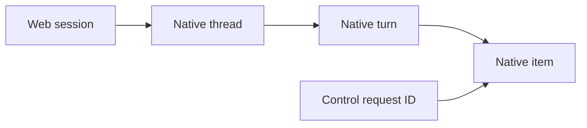

# Native Codex integration

Codex uses its documented **app-server JSONL API**, through the installed `codex` command on PATH. Native configuration, credentials, tools, instruction loading, approvals reviewer and sandbox enforcement remain Codex's responsibility. The adapter must not replace them with Pi defaults, exported credentials or an alternate command executor.

This document records the native contract, setup and compatibility evidence for issue #92. The production adapter has deterministic native-process coverage and a separately recorded bounded actual-wrapper browser canary. These are different evidence classes; real approval prompting remains untested.

## Protocol pin and setup

| Component | Audited value |
|---|---|
| Native binary/protocol | `codex-cli 0.154.0` |
| Actual model provider | The configured native provider and credentials |
| Checked-in exact generated schema | [`tests/fixtures/codex-0.154.0/schema.json`](../tests/fixtures/codex-0.154.0/schema.json) |
| Schema hash, regeneration command and source reference | [`pin.json`](../tests/fixtures/codex-0.154.0/pin.json) |
| Primary API documentation | <https://developers.openai.com/codex/app-server.md> |
| Pinned primary source | <https://github.com/openai/codex/tree/6b9826e3aa83b1a5947db50f4332cb9c65f1b340/codex-rs/app-server> |

Check setup without submitting a model request:

```sh
command -v codex
codex --version
codex app-server --help
codex app-server generate-json-schema --experimental --out /tmp/codex-schema
```

The exact installed schema is authoritative when current online documentation differs. Preserve the configured native launch and authentication path; installation-specific wrappers may differ from a direct binary invocation.

Do not override `HOME`/`CODEX_HOME` for a real-model canary: a disposable HOME can prevent native configuration resolution. Direct invocation of a pinned native binary is acceptable for credential-free version/schema/protocol-syntax checks, but is **not** equivalent to validating the configured production authentication path.

The shared service enables the optional native harness chooser with `PI_WEB_MULTI_HARNESS=1`; Pi remains the default. Use the normal documented pi-web launch procedure rather than creating another serving path.

Isolate pi-web metadata instead: use a scratch `PI_CODING_AGENT_DIR`, `PI_WEB_AUTH_STORE`, `PI_WEB_SESSION_UI_STATE_FILE` and `PI_WEB_NATIVE_BINDINGS_FILE`; keep native environment/credentials server-side. Use a scratch cwd or private worktree. No credential copying or login changes are needed.

## Native settings are authoritative

The metadata-only real-wrapper probe used only `{cwd, ephemeral:true}` on `thread/start`. It observed:

- the configured native provider and model;
- effective reasoning effort **medium**, although `model/list` suggested **low**;
- approval policy `on-request`, reviewer `auto_review`;
- read-only sandbox with network access disabled.

Production start/resume/prompt requests omit model, effort, policy, reviewer, sandbox and instruction overrides. Display returned effective settings; never apply catalog defaults automatically. Experimental API negotiation is used only for native approval bounds (`availableDecisions` and permission detail), not to enable alternate tools, grant permissions or expose every protocol endpoint.

## Identity, acceptance and lifecycle

Web session identity is distinct from every native identity. A native path is nullable, unstable and never a Pi `sessionFile`.



`turn/start` returns the native accepted turn, not proof of completion. Native Codex can use `turn/start` to steer an already active turn, so the adapter rejects concurrent input instead. Initial Codex sends use `mode: "prompt"`; explicit `steer`, `followUp` and attachments are disabled and service/adapter-rejected. Native request timeout is ambiguous; automatically resending a prompt could execute it twice.

`turn/interrupt` must target the exact nonempty native turn ID. The installed native implementation rejects stale/no-active targets and acknowledges a normal interrupt only after its abort event. An empty native turn ID has special startup-cancellation semantics and is not a UI wildcard.

Thread activity is independent of item/turn completion. Native thread status distinguishes idle, active (including waiting on approval/user input), not loaded and system error. Native errors can carry `willRetry`; an error or an assistant final-answer item must not falsely mark a session settled.

Command output uses the existing keyed `message_delta`, targeting the text part inside a tool result. A null initial result is established once, and the final native item replaces the authoritative aggregate once. Streaming never resends the accumulated output prefix on every chunk; regression coverage doubles the chunk count and requires less than 2.1× serialized transcript-event bytes.

## Persistence and recovery

| Native session state | Honest behavior |
|---|---|
| Live ephemeral thread | Reuse the owned handle. Metadata-only `thread/read` works; stored `thread/list` omits it. |
| Ephemeral thread after owned process loss | Explicitly unavailable/expired; web metadata may be removed. Never call resume or manufacture durable history. |
| Persistent but never prompted | Native storage may not yet be materialized. Even a non-null start path does not prove resumability. Probe the native ID: cached `unmaterialized` metadata may be stale after native acceptance followed by a host crash. An actually unmaterialized thread returns `no rollout`; never recreate or replay input. |
| Materialized persistent thread | Resume by native thread ID and hydrate native history through public operations. No native JSONL/SQLite parsing. |
| Process died after ambiguous dispatch | Mark interrupted connectivity/recovery state, not successful completion. Resume authoritative history; do not replay the prompt. |

A surviving native server can replay outstanding approval requests when a client rejoins. Deduplicate those by exact native request identity. No exactly-once/replay cursor guarantee has been established for incremental text; terminal native items and resumed history are authoritative.

Hydrated history has no per-item timestamp in the pinned native schema. Omit unknown message timestamps and tool `startedAt` values rather than replacing them with reopen time. Live native timestamps or live receipt times remain available; reopening must not make an old conversation appear newly generated.

## Approval safety

Command approvals distinguish **allow once**, **allow for this session**, **decline action** and **stop turn**. Only offered and implemented choices are exposed. Decline rejects the action but lets Codex continue; cancel maps to native abort. Persistent exec/network-policy amendments are deferred rather than interpreted by pi-web.

Approval context is not a diagnostic summary. **Request details** contains complete, reversible JSON, bounded at **32 KiB UTF-8 for the entire rendered context**. Commands, plain URLs, cwd, environment, reason, permission paths and proposed/deferred policy rules are never silently shortened or masked while retaining Allow. Unsupported or malformed scope fields, missing authoritative command/cwd for a command approval, credential-like values, concealed control/bidi characters, or an exceeded bound fail closed. No generic permission engine is added: native Codex still enforces the selected native decision.

A complete command request can be reviewed without a tool row. The [pinned native implementation](https://github.com/openai/codex/blob/6b9826e3aa83b1a5947db50f4332cb9c65f1b340/codex-rs/app-server/src/bespoke_event_handling.rs#L717-L804) deliberately retains exact approval commands while it may shorten/redact history: that row is never used to fill missing consent fields. Native subcommand callbacks retain their exact request and callback identity. Codex's explicit network-only presentation intentionally omits command/cwd: the dialog labels and shows the native host/protocol scope, rather than substituting a historical command or implying one was supplied. Policy-amendment options remain unavailable, with their full context marked as not applied by offered choices. Conservatively, URLs with userinfo, query strings or fragments are also deferred rather than partially redacted and approved; plain destinations remain intact. Unsafe command metadata is withheld from its correlated tool row.

File approvals require the exact live native file-change item and expose every source path, rename destination, diff and requested root together. Safe changes keep `details.diff` available to the renderer; unsafe/oversized change details are withheld rather than leaking through that alternate surface. Missing, unknown or oversized context cannot grant. The native schema marks `grantRoot` unstable, so broader file-session grants are not offered. Permission requests separately allow only the exact validated profile for the native **turn** or **session**, or grant nothing; the browser cannot supply replacement permission JSON.

Responses are validated against the outstanding request and its thread/turn/process identity. Duplicate, foreign-session, resolved, expired or previous-process replies cannot grant anything. `serverRequest/resolved` removes stale dialogs. Known deferred controls receive documented no-grant responses; unknown required controls receive an explicit native error and safe execution cleanup, not silence or fabricated approval.

A stale/foreign native approval callback gets a JSON-RPC error, **not** `cancel`: native cancel means abort and could otherwise cancel a newer turn. No interrupt is dispatched for such callbacks. A current-turn unsupported control may be cancelled and interrupted by exact native ID; a raced stale-interrupt acknowledgement must not dispose a newer healthy execution. The [pinned native handlers](https://github.com/openai/codex/blob/6b9826e3aa83b1a5947db50f4332cb9c65f1b340/codex-rs/app-server/src/bespoke_event_handling.rs#L1968-L2160) map client errors to denied command/file actions or an empty turn-scoped permission grant, not abort.

Unknown informational variants are tolerated separately. Retain only bounded/redacted observations (method/shape/known IDs/size), never arbitrary credential-bearing native envelopes in browser persistence. Do not discard already accumulated text when an additive native variant appears.

## Compatibility matrix

These classifications distinguish native availability from the first adapter surface. Existing Pi behavior remains Pi's responsibility; Codex does not impersonate its extensions, queues or history tree.

| Area | First Codex treatment | Native basis / limitation |
|---|---|---|
| Create/list/open/resume | Supported; production-adapter deterministic tests | `thread/start,list,resume`; lazy materialization, stale metadata reconciliation and ephemeral limits above. |
| Text/tool stream | Supported; production-adapter deterministic tests | Correlated thread/turn/item deltas and authoritative completed items. Native MCP inline text/images are retained as canonical result parts; local image paths are not read/exported. |
| Thinking | Supported when exposed; deterministic tests | Only native reasoning summaries/content; no fabricated thinking. |
| Exact interrupt | Supported; deterministic races/late-event tests | Host stale guard maps to the exact native turn ID, not process-wide abort-by-default. |
| Steering/follow-ups | Deferred and disabled | No implicit active-turn `turn/start` steering. |
| Command/file/permission approvals | Supported only with complete, safe context within 32 KiB | No second enforcement system; ambiguous/unsupported/credential-like context fails closed. See URL and subcommand boundaries above. |
| MCP elicitation/user-input/dynamic tools | Deferred positive workflows | Explicit no-grant/error path; no generic form engine or Pi extension port. |
| Models/effort | Native effective display | No production overrides or catalog-default substitution. |
| Plans/diffs | Contextual display; deterministic tests | Dedicated review/plan editing workflows deferred. Review item text is recognized, but native review control is not advertised. |
| History tree/fork/revert | Deferred and disabled | Native fork is inclusive at `lastTurnId`; not equivalent to Pi navigation or filesystem rewind. |
| Queues/follow-ups/compaction controls | Deferred and disabled | Native experimental queues and compaction differ from Pi. Native retry behavior remains native. |
| Native instructions/skills/hooks | Inherited | No second loader or automatic Pi command/skill compatibility claim. |
| MCP/plugin configuration | Native, no administration UI | Native tools stay configured/authenticated in Codex. |
| Subagents | Native observed activity only | No claim that pi-web worker spawning/completion relations are ported. |
| Usage | Native token values; deterministic tests | Token counters are omitted until a valid native usage report, including after create or reopen. Missing or invalid required counters do not become zero; the pinned schema's explicit zero default for `cacheWriteInputTokens` is preserved. A reported zero remains zero. Monetary cost is omitted, and token usage is not treated as measured context occupancy. |
| Host/browser Pi extensions | Pi-only unless separately audited | Dialogs/renderers/resources/artifacts/worker tools require explicit compatibility. |
| Remote/realtime/process/filesystem admin | Not in initial surface | `thread/shellCommand` and `process/*` bypass native sandbox; never use them as tool shortcuts. |

## Reproducible validation

```sh
npm run typecheck
npm run test:unit -- tests/codex-transport.test.ts tests/codex-approvals.test.ts tests/codex-adapter.test.ts tests/codex-service.test.ts
# Also check the optional native leaf independently of a dynamic module loader:
node node_modules/typescript/bin/tsc --noEmit --target ES2022 --module NodeNext --moduleResolution NodeNext --strict --skipLibCheck server/session/adapters/codex/index.ts
```

The native process peer is documented in [`tests/fixtures/codex-peer.md`](../tests/fixtures/codex-peer.md). It enters through production subprocess JSONL ingress, with independent scratch-file controls for acceptance/rejection, text/thinking/tool activity, approvals, interruption, terminal/thread state, unknown events and process exit. No user prompt selects a scenario, no HTTP route is fulfilled, and no alternate SessionService is used.

Trusted test-server launch options are `PI_WEB_CODEX_COMMAND` plus JSON-array `PI_WEB_CODEX_ARGS`, with fixture-only `PI_WEB_CODEX_PEER_DIR`. Factory construction performs only executable availability checks; it does not start Codex or check authentication. This synthetic peer is LLM-free. Its synthetic persistence is **not** proof of actual native durable resume.

Browser tests can import `mcpImageEvents(threadId, turnId)` and `codexFixturePng` from [`codex-native-events.ts`](../tests/fixtures/codex-native-events.ts), then send each frame with `controlPeer(peer, {action:"emit", message:frame})`. The same exact native MCP image frames are exercised through the production adapter, without browser-native schema interpretation.

The separate metadata-only actual-wrapper audit exercised handshake, account readiness without token refresh, model list, ephemeral create/read/list, failed ephemeral resume, process shutdown/restart and repeated failed ephemeral resume. Both owned native processes exited cleanly; no generation/tool/approval/durable-resume canary ran in that audit. Inference entitlement was untested at that metadata-only checkpoint; the later actual-model result is recorded below.

### Recorded implementation checkpoint

Against the baseline lockfile and canonical v2 core:

| Check | Result |
|---|---|
| `npm run typecheck` and strict native-leaf TypeScript check | Passed |
| `npm run build` | Passed (existing large-chunk advisory only) |
| Native transport/approval/adapter suites | 53 tests passed |
| Native production service + host relay suite | 2 tests passed |
| Those suites plus existing `session-service` and `session-adapter-service` regressions | 94 tests across 6 files passed |
| Actual native generation/tool/approval canaries | Not run in this checkpoint |
| Native browser suite | Separate integrated UI validation; not claimed by these tests |

The service tests instantiate the real `LocalSessionService`, real Codex adapter and native process peer, and subscribe the production host event handler. They validate web/native identity, supported stream/approval/interrupt behavior, disabled operations, persistent restart without prompt replay and web-metadata-only removal. A registered real Pi adapter is not invoked; an explicit failure spy catches accidental Pi fallback.

Full repository validation remains `npm test` (parallel runner), plus actual browser and native-harness acceptance evidence. The independent baseline had known browser failures; this checkpoint is not a full-suite waiver. Passing protocol/unit fixtures alone is not that completion gate.

### Review fixes and actual canary — 2026-09-14

This checkpoint borrows the assembled core/Claude/UI tree equivalent to integration `9de905f`, including UI `f91bdcd` for nested tool-result deltas and omitted history times. Only Codex adapter/tests/docs are changed by the follow-up.

| Deterministic check | Result |
|---|---|
| Fresh `npm ci`; project typecheck; strict native leaf and all owned Codex test sources | Passed |
| Native transport/approvals/adapter/service, native UI state and production HTTP/WS tests | 70 tests across 6 files passed |
| Production HTTP/WS desktop and mobile browser suite, **synthetic native executable** | 18 tests passed, no retries |
| Production build and diff whitespace check | Passed |
| New regressions | Linear tool-output bytes, initially-null command result, stale/foreign callbacks, cancel/interrupt race, late interrupt failure after a newer turn, omitted hydrated times |

Actual acceptance used the installed PATH wrapper, unchanged native HOME/auth/config and no native model, effort, permission or sandbox overrides. The real app used a scratch cwd/Pi/web state, a fresh normal authenticated web token/cookie, and an unused port. There was no mock mode, fake native peer, HTTP fulfillment, login change or credential logging.

| Actual native behavior | Observed result |
|---|---|
| Browser create and authentication | Unauthenticated API rejected with 401; normal browser login minted a session cookie; Codex created with distinct web/native IDs. |
| Generation | A native model turn returned the requested marker in the browser. |
| Owned-file native tool | A native command read a random marker present only in the scratch file, not the prompt. The canonical tool result contained it; the file stayed unchanged. |
| Exact interrupt | Browser stop sent the observed host guard and received HTTP 202. A zero-generation **public native `thread/read`** subsequently confirmed that exact native turn was `interrupted`. |
| Persistent app restart/resume | Reopened the same saved web/native identity through the browser. Three earlier user inputs remained without replay; the fourth native turn's reply recalled the earlier file contents. The check asserted reply content, not an empty native tool inventory. Unknown hydrated times were omitted. |
| Effective native settings | the configured provider model, reasoning `medium`, `on-request (auto_review)`, `readOnly`. |
| Real approval prompt | **Not encountered.** No grant or policy change was made. Approval correctness remains deterministic protocol/browser evidence, not actual prompted-approval acceptance. |

The phase submitted **four model turns total**, with a 120-second watchdog for each. Two canary-only assumptions were corrected: desktop may leave its drawer open, and native interrupt returns 202 rather than 200. The zero-turn setup attempt and original three-turn record were retained. An explicit resume-only continuation reused the same owned web state and spent only the fourth unused turn; it did not replay the first three or reset the budget. Thus these are verified observations across bounded invocations, not a claim that the initial canary script ran uninterrupted.

[`tests/codex-actual-canary.ts`](../tests/codex-actual-canary.ts) is an explicit opt-in manual canary, excluded from `npm test`. It keeps a persistent four-turn budget and refuses automatic replay. Run it only with a separately authorized native-inference budget, from an owned tmux session:

```sh
PI_WEB_CODEX_ACTUAL_CANARY=1 node --import tsx tests/codex-actual-canary.ts
```

The `--resume` path is specifically for the retained three-turn record; it requires a budget of three and submits only the final resume turn. The completed phase budget is exhausted—do not rerun or reset it as part of validation.

Bounded, non-secret evidence in the Codex worktree:

- evidence retained by the author; summarized in the PR: deterministic test/build/typecheck logs; synthetic browser results.
- evidence retained by the author; summarized in the PR: actual report, retained setup/three-turn records, screenshots, budget and cleanup audit.

All three owned app processes exited, their ports had no listeners, and the cleanup audit found no process in either owned native workspace. No live-server restart/deployment occurred and no native session file was read or manually edited. This focused checkpoint does **not** replace the independently assigned full-suite acceptance gate.

### Independent approval-context finding — deterministic correction

The independent verifier reproduced two unsafe review cases: `diagnostic()` hid a command tail after 2,048 characters and replaced a non-secret URL with `[url]`, while an Allow choice remained available. The correction separates diagnostic elision from full consent context and applies the same credential/bounds protection to correlated command/file tool details. It also covers working directories, environments, permission paths, native rule proposals and rename destinations—not just the original two strings.

The unchanged verifier probe is retained by the author and summarized in the PR: both cases reproduced RED before the fix, then GREEN twice with their complete context and unchanged native decision mappings. Its hard-coded `candidate` field still identifies the original verifier snapshot; local execution used the private tree based on integration `9d5a757` plus this correction. Additional adapter and visible-details desktop/mobile browser regressions exercise the real production ingress, decline every new reviewable request, and verify that unsafe requests expose neither Allow nor concealed credentials.

This correction uses **no model calls**. The prior actual-canary budget and all captured evidence are fingerprint-checked and left unchanged; those prior observations are not being relabeled as real prompted-approval acceptance.

### Optional/null permission-profile compatibility

The checked-in native JSON schema permits omitted or null `network.enabled`, `fileSystem.entries` and `fileSystem.globScanMaxDepth`. Their value checks run only when a value is supplied. The adapter preserves these nested null/omitted representations instead of manufacturing `false`, empty arrays or numeric defaults. Non-null validation, unknown-field rejection, existing bounds, native decision mappings and existing top-level null omission are unchanged.

The corrected independent six-case schema/production-ingress probe is retained unchanged by the author and summarized in the PR. Before the repair, all six requests passed exact-schema validation but only the two controls remained reviewable. After the repair, all six remain reviewable, with requests declined rather than executed. Unit/protocol regressions additionally verify unchanged representations, turn/session/command responses and rejection of malformed or out-of-bounds values. This narrow repair changes no spawn environment or actual-model budget.
