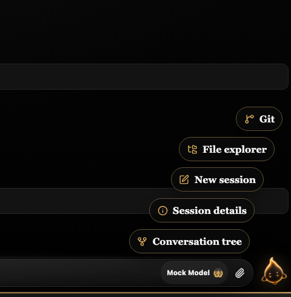
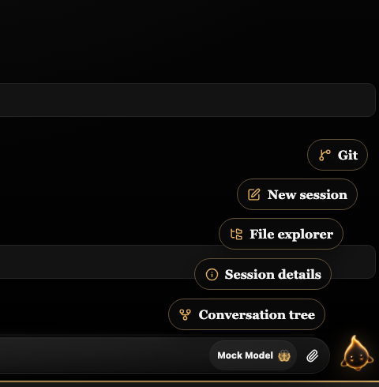

# Issue 134: settled launcher width order

Same mock-server scenario, 1280×800 Chromium viewport, cropped to 480×490 around the launcher. A test-only `700 16px Georgia, serif` button font makes the cross-font mismatch reproducible on this macOS browser. No production styles or screenshot baselines were changed. The screenshots are captured after **all menu button animations finish**.

| Baseline `e495a23` | Fixed `293038c` |
| --- | --- |
|  |  |

The corresponding [before.json](before.json) and [after.json](after.json) contain DOM-order settled `getBoundingClientRect().width` measurements in pixels. Baseline: File explorer **157.671875** before New session **153.078125** (inversion). After: New session **153.078125** before File explorer **157.671875**.

## Reproduce

Run separately in checkouts of `e495a23` and this commit, with existing dependencies available:

```sh
npm run build
cp docs/evidence/issue-134/capture.spec.ts tests/e2e/issue-134-evidence.spec.ts
ISSUE_134_OUTPUT="$PWD/docs/evidence/issue-134/after" PLAYWRIGHT_PORT=14476 \
  npx playwright test tests/e2e/issue-134-evidence.spec.ts --project=desktop --retries=0
rm tests/e2e/issue-134-evidence.spec.ts
```

For the baseline checkout, copy `capture.spec.ts` from the fixed commit into its `tests/e2e/` directory and set `ISSUE_134_OUTPUT` to an absolute path ending in `before`. Use an available isolated port if 14476 is occupied. The temporary test writes a cropped PNG and measured-width JSON; it is not a snapshot assertion. Baseline was built from a `git archive e495a23` checkout, not a simulated rendering.
