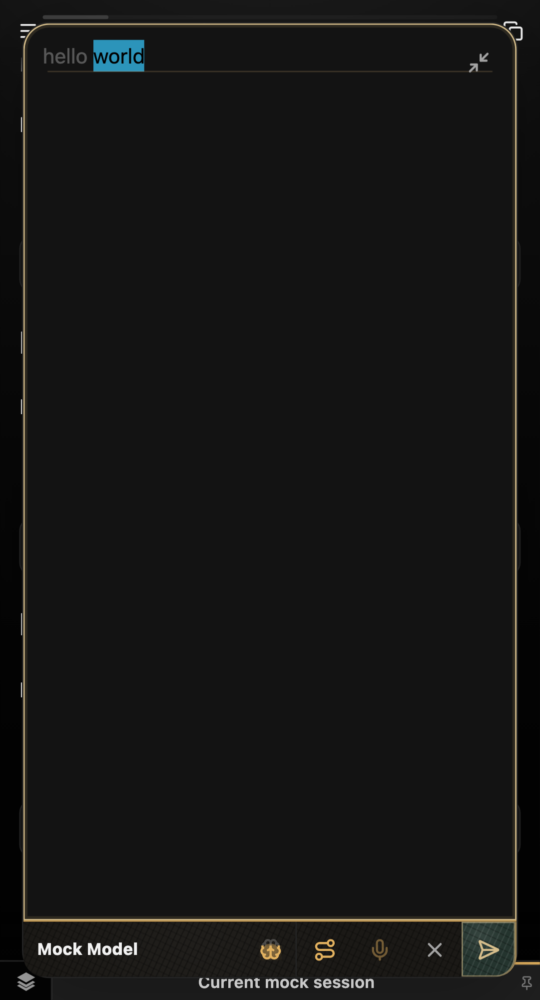
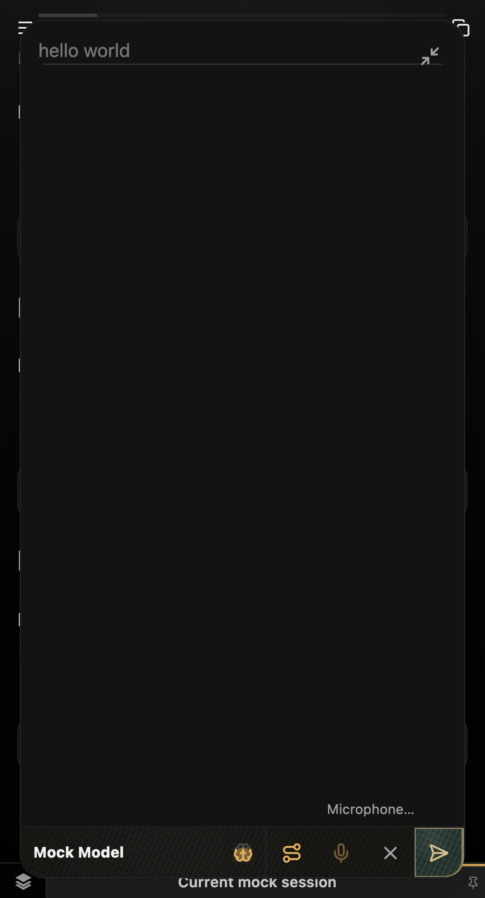

# Mobile dictation focus evidence

## Scenario

Enter `hello world`, expand the composer, focus the text field, select `world` (offsets 6–11), and tap the microphone. Hold microphone permission pending using the audio harness in `tests/e2e/composer-capture.spec.ts`.

Both captures use the Playwright Pixel 5 project: 393×727 CSS pixels, device pixel ratio 2.75, and one touch point. Capture screenshots and metrics immediately after the `Microphone…` status appears, before the first focus assertion.

| Before: baseline `637b6e0` | After: dictation focus fix |
| --- | --- |
|  |  |
| `promptFocused: true` | `promptFocused: false` |
| Selection remains 6–11; editor stays expanded. | Selection remains 6–11; editor stays expanded. |

Full observations: [before-focus.json](before-focus.json), [after-focus.json](after-focus.json).

## Reproduction

Run the regression in the mobile project:

```sh
npm run build
PLAYWRIGHT_PORT=9994 npx playwright test tests/e2e/composer-capture.spec.ts \
  --project=mobile --grep 'focused expanded editor' --retries=0
```

With the regression test applied to baseline `637b6e0`, the first `not.toBeFocused()` assertion fails. With the production fix applied, the test passes and verifies focus remains dismissed through recording and transcript insertion. The inline variant and keyboard-only projects cover the same lifecycle and selection behavior.

For the screenshots, temporary screenshot/JSON capture statements were added in a disposable worktree only; they are not included in the production tests.

Chromium cannot render a phone's native software keyboard. This evidence demonstrates the editable-focus behavior responsible for keyboard retention/dismissal, not a simulated keyboard; physical-device confirmation remains a limitation.
