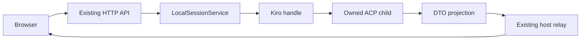

# Kiro native integration

**Kiro is the fourth opt-in local harness behind the existing `LocalSessionService` and `SessionHandle`; a bounded real browser canary now verifies generation, native read, permission decline, guarded Stop and resumed recall. Exact cold-history parity is not supported for interrupted prose.** The 2026-09-24 canary consumed its complete four-prompt authorization and confirmed ACP v1 prompt/permission frames. Native cold load replaces stopped prose with an interruption placeholder. Allow-once was offered but not exercised; remembered scopes, broad historical replay and platform parity remain unverified. Deterministic-peer evidence is separate from these real observations.

**Latest independent Kiro verdict: FAIL on `95564ac` for B2, unreported token usage displayed as zero.** Repair `2ff92f9` removes that fabricated accounting and has producer red→green evidence; fresh independent acceptance is still pending. The earlier Pi/Codex/Claude acceptance at `2f007fc` remains a separate historical result.

## Pins and native ownership

| Component | Exact target |
| --- | --- |
| CLI | `kiro-cli 2.24.0`, checked before each owned ACP launch and public catalog operation |
| Invocation | `kiro-cli acp --agent-engine v2` |
| Protocol | ACP version **1**, stdio JSON-RPC 2.0, newline-delimited UTF-8 |
| Leaf-only types | `@agentclientprotocol/sdk@1.5.0`, root v1 exports; no experimental v2 imports |
| Schema SHA-256 | `2a920d3c0f76443e07ffa7801443e3cdf008e2a3095e565581a0433fd728ce41` |
| SDK integrity | `sha512-524jwbB2iYWA+kWWyv9fhKbhU89dH/lu9u5EXwVNmfYzopV8BujCDxByBDZhxRUkB7RWIJzISCnwivdDk+bdVg==` |
| Zod peer | SDK accepts `^3.25.0 || ^4.0.0`; this application pins **4.4.3**, already resolved by the baseline |

The adapter uses a small owned JSONL transport and the pinned SDK's request, notification, content and permission types. It does not add an ACP router, alternate SessionService, tool executor, private transcript parser or browser ACP contract. Native SDK types remain inside `server/session/adapters/kiro/`.

Set `PI_WEB_MULTI_HARNESS=1` to enable native selection. Pi remains the default. Factory construction checks executable availability without launching Kiro; availability is not authentication or inference entitlement. Trusted server configuration may set `PI_WEB_KIRO_COMMAND` and `PI_WEB_KIRO_ARGS` (a JSON string array replacing the ACP arguments). The command must also accept the ordinary `--version` and `chat --agent-engine v2 --list-sessions --format json` argv; ACP argument overrides are not appended to metadata commands. Browser input cannot configure either variable. Overrides are trusted transport/test configuration, not a supported v3 engine selector; preserve the explicit v2 invocation. A missing executable, incorrect version or failed initialization never falls back to Pi.

`nativeChildEnvironment` applies separately to **all three** launches: version, public catalog and ACP. It copies the supplied environment and removes only the exact case-insensitive `PI_WEB_TOKEN` key. Native HOME, authentication, agents, hooks, tools, trust settings, MCP configuration and other environment inputs remain native. There is no trust-all flag, Pi system prompt, model default or permission-policy override. `mcpServers: []` means no client-supplied MCP additions. The separate real zero-model probe observed native MCP servers starting with this input; exhaustive native configuration inheritance still needs a canary. This is credential separation, not an operating-system sandbox.

## Real zero-model shape checkpoint

Separately authorized probes on 2026-09-24 captured 30 real frames. New returns `{sessionId,modes,models}`; load returns `{modes,models}` without a session ID. Neither response contains `configOptions`. The synthetic peer uses these field shapes with clearly synthetic mode/model values, not copied account catalogs.

Startup emits `_kiro.dev/mcp/server_initialized`, `_kiro.dev/commands/available`, `_kiro.dev/subagent/list_update` (without `sessionId`) and `_kiro.dev/metadata`, both before and after the response. These remain bounded observations, not browser commands, instructions or usage accounting. The largest captured commands notification was 78,786 bytes. The production default frame cap is **8 MiB**, with the same bound for unterminated input and buffered load replay; lower caps exist only as explicit transport-test options.

Ordinary errors preserve their correlated RPC code and omit arbitrary `data`. The real malformed-input response has code `-32700` with **no id**, rather than JSON-RPC's usual null ID. This exact exception is observed without closing an idle connection. If requests are pending, correlation is ambiguous: fail closed, retain partial content and never guess a recipient or replay input. The rejected line in `error.data` is never forwarded. Malformed public catalog JSON also produces a constant setup diagnostic, without reflecting native stdout.

The probe also saw native session/log writes and live MCP children. EOF closed both ACP parents cleanly, but descendants needed owned-group cleanup. No claim of native HOME immutability is made. The retained external probe report and frames are evidence, not a runtime dependency; the checked-in synthetic peer is portable.

## One exercised handle path



| Handle operation | Native mapping and honest limits |
| --- | --- |
| Create | Version preflight, initialize with protocol 1 and empty client capabilities, then `session/new {cwd,mcpServers:[]}`. Web UUID and native ID differ. The pinned real probe showed immediate persistence before any prompt, public source `v2` and successful fresh-child empty load; the handle reports resumable. |
| Open | Fresh child and `session/load {sessionId,cwd,mcpServers:[]}`. Buffer updates until load completes, validate identity, project replay before returning. Never send the previous prompt again. |
| List | Public CLI cwd envelopes, not unadvertised `session/list`. Filter strictly to `source === "v2"`: the real engine-v2 catalog also returned incompatible `classic` rows. Cold web bindings remain listed by the existing service. This canary verified completed nonempty history for its new source-v2 session. Arbitrary historical sessions and compaction remain unverified; native cold replay does not preserve interrupted prose. |
| Prompt | Idle, nonempty text only. `session/prompt {sessionId,prompt:[{type:"text",text}]}` returns a dispatch receipt with `acknowledgement:"not-exposed"`. The outstanding RPC response is the end of the turn, not immediate admission. No native execution ID is invented. |
| Stop | Required matching host guard, then `session/cancel` **notification**. Receipt acknowledges host dispatch, not native acknowledgement. Keep the guard and busy state until the prompt response arrives. |
| Decisions | Exact pending `session/request_permission` → server-owned opaque web choices → exact offered native `optionId`, or `{outcome:{outcome:"cancelled"}}`. |
| State, messages, subscribe | Cached DTO projection and pending interactions through the existing service/host relay. Last-viewer disconnect intentionally cancels pending decisions; reload hydration is tested with another viewer still connected. |
| Dispose | Cancel owned work and pending callbacks, close stdin, drain/discard stderr, await exit, bounded TERM/KILL of the owned process group including wrapper descendants. No session deletion. Windows process-tree parity is unverified. |

The public catalog has `updatedAt`, not `createdAt`. `AdapterSessionInfo.created`, `SessionInfoDto.created` and the web binding field are honestly optional. Existing sorting uses `modified`; unknown creation time stays absent across a cold binding reload. A host-created binding may record its known web creation time; native discovery never invents native creation time.

The source filter is evidence-driven, not inferred from the engine flag. A separate real probe created one unprompted session, found its ID under `source: "v2"`, closed the child and loaded that exact ID in a fresh child. That proves the bridge for this new empty session; it does not prove all historical sessions or nonempty content replay. The fixture now uses the same envelope fields, including `status` (not interpreted by the adapter), and persists empty sessions immediately.

Control requests retain at most 4,096 seen native IDs per child; crossing the limit closes that child safely. Permission requests expire after 120 seconds by default. Initialization/load requests default to 45 seconds and public metadata commands to 30 seconds; prompt responses deliberately have no short uniform timeout. Linux disposal allows one second before TERM and two before KILL while the leader is alive, then also cleans remaining owned descendants after leader exit.

## Content, settlement and decisions

| Native surface | Web projection |
| --- | --- |
| `agent_message_chunk` | Ordered text parts; keyed deltas rather than repeated accumulated prefixes or repeated input envelopes |
| `agent_thought_chunk` | Thinking parts only when native content is exposed |
| `user_message_chunk` | User history during load replay; live dispatched input is correlated by the host |
| `tool_call`, `tool_call_update` | Exact `toolCallId` correlation, sparse absent/null optional updates, supplied raw input only, running/completed/error status |
| Tool text and inline image content | Existing tool result parts; the real read result's bounded `rawOutput.items[].Text` shape is also projected when ACP content is absent. No arbitrary JSON rendering, local file reads or terminal execution to fill content |
| Diff `{path,oldText,newText}` | Existing `details.diff`, with full old/new text and path when safe to display |
| `plan` | One contextual system message replaced by each plan update |
| Commands and additive unknown variants | At most 32 metadata-only observations containing bounded method/variant names and byte counts; no arbitrary native envelope persistence |
| Required unknown request | Explicit JSON-RPC error and matching-execution cancellation, or connection cleanup when no session correlation exists; never silent approval |

Prompt responses retain **`end_turn`, `cancelled`, `max_tokens`, `max_turn_requests`, and `refusal`** in `MessageDto.stopReason`, including a content-free terminal response. Cancelled responses retain partial content and close unfinished tool presentation as cancelled. An unfinished tool at another terminal boundary is not invented as successful output. RPC failure on a usable child produces an error state; process loss produces unavailable state. Passive polling does not respawn; explicit reopen loads native history without prompt replay.

Native message IDs are used when supplied. Otherwise keys are deterministic replay-local ordering, not durable native turn IDs. Replay has no general per-message timestamp, so none is fabricated. ACP v1 does not put an execution ID on every notification or permission request: pending callbacks use the captured host execution, process ownership and exact tool/request IDs. Known old-tool requests and duplicate/resolved request IDs cannot affect a newer execution. This does not invent a native replay cursor or guarantee identification of every possible misordered future frame.

Only `allow_once` and `reject_once` options are exposed as accept/decline with scope `once`. `allow_always` and `reject_always` are omitted because their persistence scope has not been verified; they are never relabeled as session scope. Decline continues the turn. Stop or dialog cancellation resolves the native permission callback as cancelled and sends cancel for its owning execution. Timeout, disconnect and disposal follow the same no-grant rule. Stale answers cannot cancel newer work.

Consent context uses the existing complete, reversible JSON review principles from Codex, bounded at **32 KiB UTF-8** for the entire rendered context. Sparse requests may join only their exact live tool context. Missing input, unsupported tool kind, credential-like values, concealed text, excessive depth/collections or oversized context cannot grant. Unsafe tool input is withheld from the alternate transcript surface too. Kiro's arbitrary raw-input JSON additionally checks the full rendered object for credential-bearing keys, not just individual string values; this leaf-only check does not change Codex. Conflicting live request IDs invalidate the owned connection instead of leaving old grant buttons usable. The native permission engine still owns enforcement; this is not a second policy evaluator.

## Capability and acceptance boundary

All optional capabilities are false: queues, steering, follow-up, thinking-level control, tree, compaction, retry, shell, extensions, models, context, attachments and history fork. Interactions are true. Unsupported operations reject at the service and adapter boundaries. Effective `models.currentModelId` and `modes.currentModeId` returned by new/load are read-only display values, never Pi defaults or native mutation requests. Captured v2 responses have no `configOptions`; the adapter does not infer effort from the startup metadata's list of supported levels.

**Supported (deterministic peers)** means the production adapter, LocalSessionService, HTTP/WS and real browser exercised a synthetic executable. Real zero-model captures establish the new/load/settings/startup shapes. The separately authorized actual canary below establishes a bounded set of prompt-turn, permission and nonempty replay observations. The audit found public Kiro documentation using `session/notification`, `TurnEnd` and prompt `content`, whereas the pinned ACP v1 schema uses `session/update`, a prompt response with `stopReason`, and prompt `prompt`. The real canary confirmed the pinned dialect. Additive `_kiro.dev/session/update` notifications with `tool_call_chunk` precede canonical tool calls and remain observations, not a second transcript dialect.

Still **unverified or limited after the real canary**:

- Allow-once execution: the option was offered but not selected. Remembered permission scopes remain unverified and hidden.
- Historical v2 sessions and compaction identity changes. Completed history replayed for this newly created session; native cold replay replaced stopped prose with `Response was interrupted by the user`, so it cannot recover the live partial text.
- Authentication refresh, long-running entitlement changes, limit/refusal endings and broader prompt/cancel races. Actual `end_turn` and `cancelled` settlement were observed.
- Native agent, hook, tool and MCP inheritance with the exact startup inputs.
- Canonical macOS and Windows launch/cleanup behavior.
- The adapter does not expose token usage, cost/currency or context occupancy. `stats.tokens`, `stats.cost` and `stats.contextUsage` remain absent, including after completed turns and cold load; Session details displays `—`, not a measured zero. Projected message counts are not token estimates.

Ephemeral creation rejects with 400 and expired ephemeral open with 410. Output images do not enable uploads. Native filesystem access is distinct from host Files/Git features. Pi extensions, worker tools and settings remain Pi-only.

## Reproducible zero-model validation

Run in an isolated owned checkout, not the live server. The synthetic executable requires `PI_WEB_KIRO_PEER_DIR`, checks metadata/ACP argv, records both wire directions, and accepts atomically numbered command files under `peers/<pid>/commands`. No prompt string selects a scenario. Its `synthetic-sessions` directory is explicitly fixture persistence, not a native private store. Controls include streaming updates, sparse tools, permissions, terminal responses, process exit, raw bytes, stderr flooding and owned descendants. See `tests/fixtures/kiro-peer-control.ts`.

Implementation commands executed without real model calls:

```sh
npm ci
# Internal registry credentials expired during dependency install. Refresh only npm auth:
harmony npm
npm install --save-exact @agentclientprotocol/sdk@1.5.0 zod@4.4.3
npm run typecheck
node node_modules/typescript/bin/tsc --noEmit --target ES2022 --module NodeNext \
  --moduleResolution NodeNext --strict --skipLibCheck server/session/adapters/kiro/index.ts
npm run build
npx vitest run tests/kiro-transport.test.ts tests/kiro-adapter.test.ts \
  tests/kiro-service.test.ts tests/session-kiro-http.test.ts
PLAYWRIGHT_BROWSERS_PATH=/home/ashwinpc/.cache/ms-playwright PLAYWRIGHT_PORT=23896 \
  npx playwright test tests/e2e/native-harness.spec.ts --grep Kiro \
  --project=mobile --project=tablet --project=desktop --retries=0 --repeat-each=2
```

Build the changed frontend **before** the browser command: production `server.ts` serves `dist`, and an old bundle does not know Kiro. The first browser attempt exposed that stale-bundle setup error; the next exposed a test assumption about reloading the last viewer. The final test keeps another real viewer connected for hydration, while separate adapter tests assert last-viewer cancellation. The settings assertion dismisses by clicking visible native prose, avoiding both the retained desktop drawer edge and mobile compact-toggle behavior.

The full gate is **`npm test`**, not selected suites or `test:serial`. Use the allowlisted disposable HOME/state recipe in [native compatibility](native-compatibility.md#deterministic-full-gate--no-real-models), explicit `PLAYWRIGHT_BROWSERS_PATH`, and free static ports. The implementation run uses offset `14000` and Playwright port `23896` in separate, non-overlapping jobs. Never reuse public ports 8787/8788 or restart the running checkout.

No actual Kiro executable was started by the implementation validation commands: every Kiro create/load/prompt path used the synthetic executable. Separate zero-model evidence from 2026-09-24 informs that peer without mixing actual capture content with synthetic transcript data. A real canary is a separate authorized phase with a persistent budget, native configuration intact and an explicit allowance for native session/log writes. Green deterministic tests grant no inference budget or deployment permission.

## Recorded producer gate — 2026-09-24

The frozen tested code is **`9dcc6f3b3f27360d682f36499b3cb8bdf13fffa2`**, on the accepted three-harness base `28ae094`. Node 24.15.0 and npm 11.12.1 were used. Documentation-only changes after this pin do not change the tested source.

| Check | Result |
| --- | --- |
| Project typecheck, strict standalone Kiro leaf check, complete build | Passed |
| Four focused native suites | **54 passed**, zero skips/failures |
| Kiro browser matrix, two repeats across three viewports | **12 passed**, zero skips/failures/retries |
| Scroll regression matrix, three repeats across three viewports | **27 passed**, zero skips/failures/retries |
| Complete parallel `npm test`, two shards and concurrency four | **853 unit passes / 2 skips; 897 browser passes / 55 skips; zero failures/retries**, 443.5 seconds |
| Existing snapshots | Unchanged |
| Native model canary | Not part of this producer gate; subsequently run under the separate four-prompt authorization below |

The two unit skips are the existing opt-in Claude configuration and synthetic-SSE actual-CLI cases. Browser skips are the same 55 existing conditional cases: 49 viewport-specific and six opt-in diagnostics. The full browser breakdown is mobile 302/9 skipped, tablet 271/40, desktop 305/6, and auth 19/0. Exact names are retained in the producer skip inventory; passing counts are per checkpoint, not additive.

The full gate exposed a **pre-existing** shared scroll race: explicit wheel intent was discarded while the programmatic-scroll reset was pending. Both the original renderer and original failing test were unchanged from the base. A deterministic browser probe reproduced it red, and `9dcc6f3` removes only that input-handler guard while preserving the separate guard on actual programmatic scroll events. The original selection assertion is unchanged. This repair is independently reviewable from the Kiro leaf and explains the three additional browser cases.

Producer receipts live under `.pi/web/artifacts/kiro-implementation/`: exact commands, source hashes, red/green evidence, full logs, skip inventory and cleanup. These are supplementary evidence, not required runtime/test inputs. Earlier setup failures and the inherited failing full run remain recorded; they are not counted as acceptance. All owned validation processes finished, owned ports were checked free, and scratch validation homes were removed. No live restart, push, native-home change or real model call was performed by this worker.

## Unknown-usage repair — B2

The independent audit of `95564ac` passed its full regression suite (**856 unit passes / 2 skips; 897 browser passes / 55 skips; zero failures/retries**) but returned **FAIL** after an additional production-server/browser probe showed “0 tokens” following a completed turn with no native usage measurement. That counterexample takes precedence over the green suite. Its historical verdict is not rewritten by a producer repair.

**`2ff92f9`** makes `SessionStatsDto.tokens` optional and removes unobserved initial zeros from Kiro, Codex and Claude. Kiro has no supported usage mapping and continues to omit the field. Codex populates valid native totals; Claude populates valid, nonempty current-Query `modelUsage`. Reported zero is still a known zero. Pi's production accounting is unchanged. Existing Session details and context-meter consumers already handle absence; the typed Claude canary reader now uses optional chaining without executing the canary.

The unchanged auditor probe failed on the old production code and passed twice on repaired production bytes: API token fields absent, visible tokens `—`, and message counts still one user, one assistant and two total. New adapter, HTTP/WS and [native browser regressions](../tests/e2e/native-harness.spec.ts) cover completion, page reload and cold reopen; a Codex browser control requires a subsequent native zero measurement to display `0`. Project/strict checks, 146 focused tests, the Claude suite (50 passes / 2 opt-in skips) and 24 repeated browser cases passed. These suites overlap and their counts are not additive. No model calls or actual Kiro executions were made for this repair; all real-canary budgets remain exhausted. A fresh independent verdict remains required.

**Full producer gate on `2ff92f9aaeb3528c2e8064832a72978fd20c0555`:** all 587 tracked validation files matched the committed repair. Complete build and strict checks passed. The parallel `npm test`, with two shards and concurrency four, finished in **465.0 seconds**: **868 unit passes / 2 existing skips; 900 browser passes / 55 existing skips; zero failures/flakes/retries**. Browser results: mobile passed 303 with 9 skips; tablet passed 272 with 40 skips; desktop passed 306 with 6 skips; auth passed 19 with no skips. No snapshots changed. Subsequent documentation-only changes do not alter the validated runtime or tests; this producer result does not close the independent B2 gate.

## Bounded actual browser canary — 2026-09-24

**Result: verified core paths with a native cold-replay limitation, not full parity. All four authorized prompt turns are consumed.** Linux CLI 2.24.0 ran through the production application (`PI_WEB_MOCK=0`, multi-harness enabled), real Playwright Chromium, authenticated token/setup flow and landing Kiro selector. The app used loopback port 21941 and isolated web/Pi stores; the workspace was under `/tmp` with no `artifact` component. Native HOME, authentication, agent, model, effort and permission configuration were inherited unchanged by the launcher. No trust flags or native configuration edits were made.

| Turn | Actual observation | Result |
| --- | --- | --- |
| 1: read and generation | Native read obtained a random marker absent from the prompt; streamed answer, tool card, read-only model `auto` / mode `amzn-builder`, `end_turn`, Stop hidden and public catalog source `v2` verified. No read permission request occurred. | PASS; read permission NOT ENCOUNTERED |
| 2: harmless write | A sparse `session/request_permission` joined its exact live edit tool. Options were `allow_once`/Yes, `allow_always`/Always and `reject_once`/No. UI decline selected exact `reject_once`; no file was written. Native did not re-ask. | Decline PASS; allow-once NOT ENCOUNTERED |
| 3: streamed Stop | Browser Stop carried the matching host guard; adapter sent the `session/cancel` notification; prompt response returned `stopReason: cancelled`. Partial text remained after settlement and page reload, with no running tool cards. | PASS |
| 4: cold load and recall | Owned app restarted with the same isolated stores. Drawer open invoked fresh-child `session/load`; completed text/tools and native identity replayed without resending input. A fourth explicit prompt recalled the marker. Native replay replaced interrupted prose with its own placeholder rather than the original partial answer. | Recall PASS; exact cold-history parity FAIL (native replay limit) |

The actual permission request has `toolCall.{toolCallId,title,rawInput}` without kind/status, and `_meta.trustOptions` describes native path/directory trust candidates. The existing exact live-tool join supplies kind; the web exposes only once choices and does not mutate native trust settings. No allow-always choice was sent. Live canonical updates included `tool_call`, `tool_call_update` and `agent_message_chunk`; replay also emitted user chunks and empty thought chunks (not evidence of nonempty reasoning). Prompt requests use `prompt`, canonical notifications use `session/update`, and responses carry `stopReason`, resolving the documentation drift for this pin.

The canary exposed one adapter defect: the native read result supplied `rawOutput: {items: [{Text: "…"}]}` without ACP `content`, leaving a completed card with no result. **`33f00db`** adds a bounded, shape-specific fallback; explicit ACP content retains precedence and arbitrary or unsafe raw output is not rendered. A deterministic executable-peer regression first failed on the missing result, then passed; replay of the original real read after the fix displayed the captured result without repeating its prompt. Additional synthetic tests cover the actual sparse permission/options shape and native interrupted replay placeholder. They use synthetic content, not real captured transcript data.

The first runner attempt also timed out while dismissing the native settings popover after successful turn 1. Only that UI helper was corrected; the remaining zero-model assertions were completed during an explicit continuation. The immutable budget reservations were not reset. The runner initially labeled its four turn statuses PASS despite recording `coldHistoryExact: false`; the final assessment and runner now correctly distinguish successful recall from failed exact cold replay. No extra model call was spent to improve the label.

Evidence is in `.pi/web/artifacts/kiro-actual-canary/`: `report.md`, `report.json`, `frames-redacted.jsonl` (106 actual frames), `budget.json` (four reservations and four actual prompt frames), screenshots, redacted logs, red/green proof and final validation receipts. The runner is `tests/kiro-actual-canary.mjs`; its executable wrapper is a real CLI pass-through with exact argument and reserved-budget guards, not a response peer. It is opt-in and excluded from `npm test`. The exhausted ledger intentionally prevents another run.

**Final deterministic gate on code `46dddfa710993aa0e7a00e5c9bb4858a3a411839`:** project and strict standalone leaf typechecks, complete build and **57 focused passes** succeeded. Full parallel `npm test`, using disposable HOME/state, explicit browser cache, two shards and concurrency four, finished in **445.8 seconds**: **856 unit passes / 2 existing skips; 897 browser passes / 55 existing skips; zero failures/retries**. Browser breakdown: mobile 302/9 skipped, tablet 271/40, desktop 305/6, auth 19/0. No snapshots changed. The opt-in runner's final guard tightening was syntax-checked but not given another native turn; the full suite never executes real canaries. Documentation-only commits after this source pin do not change the tested code.

Normal native startup wrote log/session files. Before/after native inventory records names and mtimes only, not content; concurrent native activity prevents exclusive attribution of all changes. The owned app and all 12 captured wrapper process groups were absent after cleanup; scratch workspace, isolated stores and private raw captures were removed. Native sessions/logs were left to Kiro, not manually deleted. Allow-once enforcement, remembered scopes, auth refresh, arbitrary historical sessions, compaction, images/diffs in a real turn, usage accounting and macOS/Windows remain unrun.

Primary protocol references: [ACP initialization](https://agentclientprotocol.com/protocol/v1/initialization), [session setup](https://agentclientprotocol.com/protocol/v1/session-setup), [prompt turn](https://agentclientprotocol.com/protocol/v1/prompt-turn), [tool calls](https://agentclientprotocol.com/protocol/v1/tool-calls), [Kiro ACP](https://kiro.dev/docs/cli/acp.md), [Kiro v3 migration](https://kiro.dev/docs/cli/v3.md). Live documentation is not immutable evidence of the pinned binary's post-initialize behavior.
