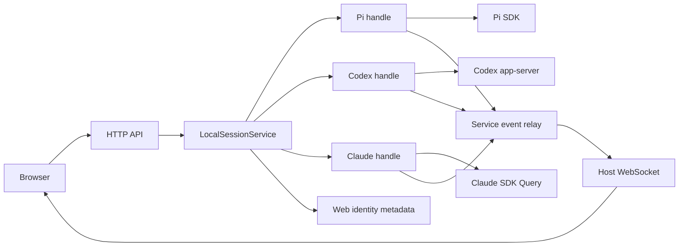

# Pi and native harness sessions

Pi, native Codex and Claude use **one local session service, one live-handle cache and the existing browser UI**. This is an opt-in implementation under review, not a full-parity, release or deployment claim.

**Source snapshot:** `617ab3fb24d7ffb5772742d75b98dc49c8402089`, 2026-09-14 (the assigned `0fbe2c1` snapshot plus the Codex consent-context correction). The [compatibility matrix](native-compatibility.md) records feature-by-feature consumers, tests, actual observations and unresolved gates. Pi stopped-text presentation and native-child inheritance of the host control token remain known defects; the new Codex correction still needs independent acceptance.

## The exercised path

HTTP operations dispatch through `LocalSessionService` to an owned behavioral handle. Adapter events return through the same service subscription and host relay; native messages do not use the Pi mock broadcaster or require a second server.

A **harness** chooses the agent; a **runtime** chooses where it runs. Here Pi runs in the host process, Codex owns an app-server child, and Claude's SDK owns its native child. The child processes are native implementation details, **not** the #119 pi-web NDJSON runner. ACP, Docker, SSH, remote-runtime selection and cross-harness transcript migration are not implemented by this work. [Runtime binding constraints](runtime-binding-design.md) remain separate; no extra router or universal tool/session framework is reserved for them.

### Ownership in source

| Owner | Current responsibility |
| --- | --- |
| [`server/session/adapter.ts`](../server/session/adapter.ts) | `SessionAdapter.create/open/list` and `SessionHandle.state/messages/prompt/interrupt/respondInteraction/cancelInteractions/subscribe/dispose`. Native SDK objects do not cross this contract. |
| [`server/session/service.ts`](../server/session/service.ts) | Web-ID lookup, the live cache, coalesced opens, input admission, Pi-only operation gates, viewer/work leases, initialization publication and disposal. |
| [`adapters/pi/adapter.ts`](../server/session/adapters/pi/adapter.ts), [`pi/index.ts`](../server/session/adapters/pi/index.ts) | Actual `createAgentSession`, resource/extension binding, Pi projection, model/command/tree/shell operations, queues, retry compatibility and SDK shutdown. Rich Pi methods stay explicit on `PiSessionHandle`. |
| [`adapters/codex/index.ts`](../server/session/adapters/codex/index.ts), [`transport.ts`](../server/session/adapters/codex/transport.ts) | Native app-server handshake, thread/turn/item/request correlation, authoritative thread activity and owned JSONL transport. No Pi model/tool executor is substituted. |
| [`adapters/claude/index.ts`](../server/session/adapters/claude/index.ts), [`native.ts`](../server/session/adapters/claude/native.ts) | Lazy `query()` input, native SDK readers/resume, query-generation guards and the documented native process seam. `transcript.ts` and `approvals.ts` project content and resolve native controls. |
| [`nativeBindings.ts`](../server/session/nativeBindings.ts) | Atomic pi-web-owned web/native identity, cwd, display metadata and removal tombstones. It is not a native transcript store. |
| [`dto.ts`](../server/session/dto.ts), [`hostEvents.ts`](../server/session/hostEvents.ts), [`activity.ts`](../server/session/activity.ts) | Serializable snapshots, ordered parts, interaction lifecycle, host activity decoration and browser wire events. Native protocol types remain in their adapters. |
| [`server.ts`](../server.ts), [`server/realtime.ts`](../server/realtime.ts) | Authenticated HTTP/WS entry, lazy native factory registration, realtime sequencing/replay, host files/Git/UI metadata and completion plumbing. |
| [`src/app/sessionState.ts`](../src/app/sessionState.ts), [`src/realtime/realtime.ts`](../src/realtime/realtime.ts) | Per-session browser state and event reconciliation. [`messageList.ts`](../src/messages/messageList.ts), [`content.ts`](../src/messages/content.ts) and [`toolCards.ts`](../src/tools/toolCards.ts) consume the shared transcript. |
| [`server/mock.ts`](../server/mock.ts) | A controllable Pi SDK peer. It emits through SDK subscription ingress; it is not a second browser event path. Native tests have their own protocol/SDK peers. |

The Pi adapter's raw-session `WeakMap` only associates extension callbacks with their owning Pi handle. Its bridge sinks do not replace the service's live cache or introduce another operation dispatcher.

## From operation to visible behavior

The full [matrix](native-compatibility.md#feature-matrix) adds native operation names and per-feature test provenance. These are the application entry points they share:

| Application operation | Handle/contract | Actual consumer |
| --- | --- | --- |
| `GET /api/harnesses`; `POST /api/sessions/new` | Catalog plus `SessionAdapter.create` → `SessionSnapshotDto` | [`sessionDrawer.ts`](../src/sessions/sessionDrawer.ts) and [`harnessChoice.ts`](../src/sessions/harnessChoice.ts), in the landing and drawer flows |
| `GET /api/sessions`; `POST /api/sessions/open` | Adapter `list/open`, web binding → `SessionInfoDto` / snapshot | Drawer identity badges, open/history loading and [`sessionInfo.ts`](../src/sessionInfo/sessionInfo.ts) |
| `POST /api/prompt`; `POST /api/abort` | Handle `prompt/interrupt` → `PromptReceiptDto` / `InterruptReceiptDto`; later authoritative snapshots | [`composer.ts`](../src/composer/composer.ts), status and realtime state; HTTP 202 alone does not clear Stop |
| `GET /api/messages`; transcript events | `MessageDto.parts` and keyed start/part/delta/replace events | Existing message list, thinking/tool cards, inline images and diff affordances |
| `POST /api/interactions/respond` | `InteractionResponseDto` → owning handle's native validation | [`interactions.ts`](../src/realtime/interactions.ts), pending snapshots and request/resolved events |
| `POST /api/session/name`; `POST /api/sessions/delete` | Pi SDK name/delete, or native web metadata update/tombstone | Status-bar name and drawer; native removal explicitly retains native history |
| Pi context/tree/models/commands/shell/contributions | Explicit `PiSessionHandle` methods guarded by the service | Existing inspector, tree, model settings, composer and extension surfaces; not native API emulation |

Omitted `harnessId` means Pi. Selecting another harness creates another session; it never retags the landing Pi UUID. Unknown, disabled or unavailable selection fails without Pi fallback. Catalog availability describes an installation, not working authentication, model entitlement or completed native initialization.

## Identity and persistence

| Field | Meaning and limits |
| --- | --- |
| `sessionId` | Public web identity. Pi retains its SDK UUID values for extensions, API/spool references and existing history. Codex/Claude receive independent web UUIDs. |
| `nativeSession.sessionId` | Actual Codex thread / Claude session / Pi session identity. It may be absent before native assignment. Pi's equal UUID value does not merge the structural roles. |
| `activeExecution.id`, `owner: "host"` | A live host stale-command guard, not a native turn or durable replay ID. |
| `activeExecution.nativeExecutionId` | Only a real native execution ID: Codex `turn.id` when known. Pi/Claude omit it; Claude assistant API IDs and wrapper UUIDs are not turn IDs. |
| Message/part IDs; `nativeItemId` | Stable rendering keys and separately exposed native item identity. They are not control-request IDs or new web sessions. |
| Interaction `id` | Web request identity; the adapter retains exact native request/tool/process scope. Numeric native request ID `0` is valid and is not replaced by a truthiness test. |
| `sessionFile` / listed `path` | Optional Pi compatibility metadata only. Native resume never uses a fabricated Pi path. |

Persistent does not mean already materialized. Codex storage may appear only after native acceptance; Claude can allocate an ID before its first Query. A cached `unmaterialized` or `unavailable` label is an observation: supported native resume/read APIs determine whether persistent history now exists. Live ephemeral handles are reused; after loss they expire with 410, without recreation. There is no browser persistence-mode selector or HTTP `persistence` field in `/api/sessions/new` at this snapshot.

Pi keeps its existing SDK/session-format handling inside its adapter. Codex uses public thread operations; Claude uses `listSessions`, `getSessionInfo`, `getSessionMessages` and Query `resume`. The host does not parse Codex/Claude private JSONL or databases. Native handles keep an in-memory transcript for display; the binding file stores only identity and display metadata, including a first-prompt preview.

Binding read/merge, validation, candidate construction, atomic rename and in-memory publication share one queue. State/discovery writes merge against the last successful row, preserving renames, previews and tombstones. Failed writes do not publish a candidate. Removing a native binding does not delete native history; Pi retains its existing trash/delete operation.

A cold lookup can lazily open a saved binding. That is different from repeatedly recovering a dead cached handle: ordinary state/message polling neither replaces that unavailable handle nor retries a failed native open. Explicit open resumes the same native identity. No host prompt replay is used to repair a failed or ambiguous dispatch.

## Initialization, acknowledgement and settlement

Creation registers early enough for startup interaction responses, but buffers ordinary state/agent/runtime/contribution publication through Pi defaults and the host post-create finalizer. The initial native binding must commit before publication. Native open also registers tentatively until its metadata refresh succeeds; a failure disposes/unsubscribes the handle and removes it from the usable cache. HTTP operations and WS hello use admission checks. These rules reuse the service's initialization state, not a second lifecycle manager.

| Boundary | Pi | Codex | Claude |
| --- | --- | --- | --- |
| Prompt receipt | `not-exposed`: SDK dispatch has no equivalent native acceptance receipt | `turn/start` acceptance exposes real turn ID; ambiguous timeout stays pending and is not resent | Async input dispatch is pending until user replay/first-reply correlation provides acknowledgement |
| Active input | Existing steer/follow-up queue behavior | Only ordinary idle `prompt`; no implicit active-turn steering | Only ordinary `prompt`; no hidden queue across a live execution |
| Stop target | SDK abort, optional matching host guard | Required host guard → exact native `turn/interrupt` thread/turn | Required host guard → captured live Query/generation; delayed control failure cannot fail a newer execution |
| Terminal versus idle | SDK `agent_settled`, including existing retry compatibility, not `agent_end` alone | Completed item/turn is not idle; thread activity remains authoritative | Result ends a turn, then native `session_state_changed: idle` settles it; the documented idle-event opt-in is requested |
| Lost process versus model error | Existing Pi error/retry path; stopped-text presentation has an open defect | Unavailable transport invalidates active work/requests | Lost Query is unavailable; a model-result error on a usable Query is a different state |

`phase`, `activity`, pending requests and the active guard travel in `SessionSnapshotDto`. No universal sequence requires every run to emit every phase. Native terminal failures close unfinished tool *presentation*, without inventing a tool result or claiming that filesystem effects were rolled back.

## Transcript and decisions

`message_start`, `message_part`, `message_delta` and `message_replace` address stable message/part keys. Ordered text, exposed thinking, tool calls/results and inline images use the existing renderer. Codex command-output deltas can address text nested inside a tool result; authoritative final items replace the final aggregate, rather than resending every accumulated prefix. Claude reconciles partial events with separate per-block finals that can share one assistant API ID. Pi retains its legacy raw/event fidelity path; native messages do not impersonate it.

Unknown native per-item history times are omitted, not replaced with reopen time. Incremental native text does not have a claimed exactly-once replay guarantee: native final items and supported history readers are authoritative. Browser sequence replay and pending-interaction hydration are separate from native transcript replay.

A request includes adapter-owned choices, context and expiry. The browser returns the web session/request IDs and an offered `choiceID` or validated answers; it cannot supply arbitrary native grant JSON. Decline/continue, cancel/interrupt, once/session grants and Claude permission suggestions remain distinct. Duplicate, expired, foreign or already-resolved replies cannot grant again. Disconnect/timeout/disposal take the adapter's documented no-grant path.

**Decision fidelity remains a release gate.** The Codex correction at this pin separates diagnostics from complete, reversible consent JSON, with a 32 KiB UTF-8 limit over the whole rendered context. Credential-like, concealed, oversized or ambiguous context cannot grant; URLs with userinfo, query strings or fragments are conservatively deferred. Exec/network policy amendments remain unavailable. `environmentId` identifies a native execution environment; it is not an environment-variable dump. Request fields, not possibly shortened tool history, are authoritative. Producer red/green and browser evidence is recorded separately from the pending independent recheck and unobserved actual prompted approvals.

## Extensions and host features are different layers

Both regular Pi extensions and pi-web contributions are loaded by Pi's runtime, not a harness-neutral extension engine. Neutral browser components can be reused without claiming that a Pi extension's tools, callbacks or registration execute under Codex/Claude.

| Surface | Current dependency and treatment | Provenance |
| --- | --- | --- |
| Pi tools, hooks, skills, prompts, instruction files and injected web context | Pi resource loader/SDK, preserved in Pi. Native loaders/configuration remain native; Pi's `contexts/web-ui.md` is not injected into them. | Pi `make/context/commands`; `context.test.ts`, `pi-adapter-sdk.test.ts` |
| `select`, `confirm`, `input`, `editor`, notifications/status and editor effects | Existing Pi web bridge, with session-scoped pending/resolved lifecycle. Native approvals/questions use their own mappings, not Pi hook interception. | `server/extensions/webUi.ts`; `extensions.test.ts`, `session-service.test.ts` |
| Terminal components, custom TUI, terminal input, theme/editor replacement | No browser terminal exists. Several existing bridge methods are no-ops; `custom()` returns no component. This is not full Pi TUI-renderer parity. | `createWebExtensionUiContext`; no positive browser claim for these methods |
| Same-session tree navigation versus a new history fork | Pi `navigateTree` remains available. All `historyFork` flags are false; bridge-initiated fork/session switching reject. Provenance is not copied history or filesystem rewind. | Pi `navigate`, `bindWebExtensions`; `conversation-tree.spec.ts`, `message-actions.spec.ts` |
| Footer, FAB, header action, panel, Git tab, artifact action/preview, new-session field | Registration/invocation requires Pi. Native snapshots expose no Pi contributions; native UI hides them and service methods reject. Generic built-in renderer reuse is not a native contribution host. | `webUi.ts`, `src/main.ts`; `extensions.test.ts`, `web-panel.spec.ts`, birth-field specs, `native-harness.spec.ts` |
| Extension settings and system-info contributions | Registrations come from Pi; settings remain retained/global Pi extension data, not native configuration. Native settings UI disables Pi editing/reload. Built-in system information remains a host feature. | `webUi.ts`, `src/settings/extensionSettings.ts`; `web-ui-settings.test.ts`, `system-info.spec.ts`, native gate tests |
| `sessions_*`, notepad and delegation spool | Pi tools/examples using scoped extension HTTP and existing UUIDs. No native tool registration or worker-spawn port is promised. | `examples/pi-web-extensions/session-orchestrator.ts`, `notepad/`; `session-orchestrator.test.ts`, `notepad-extension.test.ts` |
| Worker obligations, lineage and reference chips | Host UI consumes explicit web-session metadata/dependency declarations. Native subagent items do not create host workers or settlement obligations. | `server/session/settlement.ts`, `src/sessions/settlementDependencies.ts`, `src/app/sessionRefs.ts`; settlement/lineage/reference tests |
| Custom messages versus built-in tool rendering | Pi custom message text/details/display flags remain readable. Native ordered parts reuse generic cards; custom native/TUI renderer registration is not implemented. | `projection.ts`, `messageList.ts`, `toolCards.ts`; custom-message and native-part tests |
| Files, Git and built-in artifacts | Host routes and cwd-scoped viewers operate independently of the agent. Their operator authority is not the native tool sandbox. Extension-specific artifact actions remain Pi-only. | `server/shared/workspaceFiles.ts`, `src/files/`, `src/git/`, `src/artifactPreview.ts`; workspace/files/Git and native-browser tests |

See [pi-web extensions](pi-web-extensions.md) and [scoped extension HTTP](extension-http.md) for the existing APIs and trust model, not instructions to port them automatically.

## Configuration and review boundary

The server alone accepts executable/argument overrides. `PI_WEB_MULTI_HARNESS=1` enables selection; Pi remains the default. Native effective settings are read-only in `modelSettings.ts`; Pi's registry/defaults/credential configuration are not fallback native settings. Claude preserves its native prompt/settings sources, narrowly removes the pinned SDK's unsolicited default-permission argument, and opts into authoritative idle notifications. Details and pins are in [Codex](codex-native.md) and [Claude](claude-native.md).

Browser authentication and native provider authentication are separate. No new native login UI is added. Unknown ingress diagnostics omit/redact payloads, and arbitrary auth output is not a transcript feature. **Host-credential isolation is an open defect:** the independent presence-only probe on `0fbe2c1` confirmed twice that both runtime children inherit `PI_WEB_TOKEN` when set on the server; the relevant launch environment is unchanged at this pin. Only synthetic credentials were used, not an exploit or paid model call. Preserving native credentials does not justify forwarding the host's cross-session control credential.

Use the [setup and validation recipes](native-compatibility.md#setup-and-reproducible-validation) on an isolated review checkout. The last green regression suite, deterministic native peers and bounded actual canaries have different source pins and limitations. Known defects, the final assembled suite, canonical macOS execution and independent correctness/simplicity acceptance must remain explicit before a merge or deployment decision.
