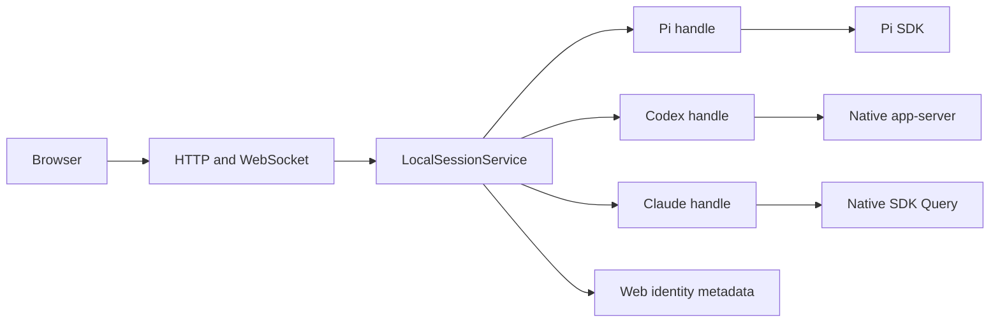

# Pi and native harness sessions

Issue #92 uses **one local service and one live-handle path**, with Pi retained as the default. This replaces the earlier ACP-first / runner-first proposal; a runner, remote runtime, universal tool framework, and cross-harness transcript migration are not prerequisites.

## Actual boundaries

- `server/session/adapter.ts`: `SessionAdapter.create/open/list`, returning `SessionHandle.state/messages/prompt/interrupt/respondInteraction/cancelInteractions/subscribe/dispose`.
- `server/session/service.ts`: the single web-ID-keyed live cache, dispatch admission, viewer/work leases, idle disposal, binding lookup, capability gates, and serialized event relay.
- `server/session/adapters/pi/`: raw Pi creation, resource loading, extension binding, projection, prompt/queue handling, retry compatibility, tree navigation, shell/slash commands, models, and shutdown. Rich Pi operations are explicit methods on `PiSessionHandle`, not a universal native invocation API.
- `server/session/nativeBindings.ts`: atomic, versioned **pi-web-owned metadata**, not a second transcript store. It records web UUID, native reference, cwd, display metadata, and removal tombstones. Corrupt/conflicting records fail closed.
- `server/session/hostEvents.ts` and `activity.ts`: one browser relay and host activity decoration. Native events do not pass through a mock broadcaster or imitate Pi events.
- `server/mock.ts`: a controllable Pi SDK peer. Its events enter the production Pi handle via `subscribe`; it has no browser-broadcast dependency.

Pi's extension bridge uses the same handle registration and work leases as every other service operation. Registration precedes `session_start` binding so startup decisions can be answered, but newborn state, agent, runtime and contribution events remain buffered through defaults and the host post-create finalizer. Interaction requests/resolutions remain live; the finalizer therefore cannot be bypassed by SDK events or deadlock their response channel. Native registration does not persist an early snapshot: the initial binding commits only after the finalizer succeeds.

## Identity and persistence

| Value | Meaning |
| --- | --- |
| `sessionId` | Public pi-web identity. Existing Pi UUIDs are preserved for extensions, orchestration, notepad, and spool compatibility. Native harnesses receive independent web UUIDs. |
| `nativeSession.sessionId` | Actual native Pi session, Codex thread, or Claude session ID. May be absent before native materialization. |
| `activeExecution.id`, `owner: "host"` | Host-owned stale-command guard. It is **not** a fabricated native turn ID. |
| `activeExecution.nativeExecutionId` | Only a real native execution ID, such as Codex `turn.id`. Pi/Claude must omit it when no equivalent is exposed. |
| Message/part IDs | Stable transcript projection keys, independent from native item/execution and control-request IDs. |
| `sessionFile` | Optional Pi compatibility metadata. Never a native routing key. |

`nativeSession.persistence` distinguishes persistent and ephemeral sessions. `status` distinguishes `unmaterialized`, `resumable`, `live-only`, and `unavailable`. Creating a persistent native session is not proof that it can resume yet. The service reuses live ephemeral handles; after process loss they are explicitly unavailable, not silently replaced or resumed.

Native removal tombstones the web binding and leaves the native transcript untouched. Pi deletion retains its existing trash/delete behavior. Native discovery uses supported adapter APIs, never private native JSONL or databases.

Binding validation, candidate construction, atomic rename and in-memory publication are one serialized operation. Failed writes leave both committed views unchanged, and no queued write can include another pending candidate. Explicit open can replace a dead persistent handle by resuming its exact native reference; an unavailable ephemeral handle remains 410. State polling never repeatedly respawns a failed native open, and recovery never replays submitted prompts.

## Input and lifecycle

A prompt receipt reports dispatch and `acknowledgement: pending | accepted | not-exposed`; it does not report settlement. Native ordinary input uses `mode: "prompt"`. Unsupported explicit steering/follow-up is rejected, not reinterpreted as ordinary input.

If steering is advertised, `expectedExecutionId` must match the observed active host guard, and that guard is preserved for the native operation. Interrupt also validates `expectedExecutionId` before invoking the live handle. Native acknowledgement of an interrupt is not an idle transition. Concurrent Claude input is disabled; native adapters must not accidentally implement a queue through a native operation that steers an already-active turn.

`phase`, `activity`, and `activeExecution` are authoritative snapshots. A final text block, tool item, message replacement, or interrupt receipt does not establish idle. Pi retains its richer retry/compaction/queue behavior, with `agent_settled` and its compatible continuation boundary distinct from `agent_end`.

## Transcript and interactions

Ordered `MessageDto.parts` contain text, thinking, tool calls/results, and images. Each message and part has a stable ID. `message_start`, `message_part` (keyed upsert), `message_delta` (keyed text/thinking append), and `message_replace` (authoritative replacement) relay unchanged. A final replacement ends the message, not the session execution. Existing Pi raw message/event fallback remains Pi-only for fidelity.

Pending decisions are included in `pendingInteractions`; `interaction_request` and `interaction_resolved` reconcile connected clients. Choices have opaque `id`, label, meaning, and optional native scope. The browser submits `sessionId`, request `id`, `choiceID`, and answers; native mapping and validation stay in the owning adapter. Decline-and-continue and cancel/interrupt remain different. Duplicate, foreign, stale, expired, and resolved replies cannot reauthorize a request.

Pi extension dialogs retain their legacy payload/response fields. They now also publish resolution and have session-scoped disposal. Losing all browser connections cancels pending interactions; adapters retain their explicit deadline policy rather than silently approving.

## Configuration and capability gates

Default Pi-only UX is unchanged. `GET /api/harnesses` exposes installation availability separately from `multiHarnessEnabled`; `POST /api/sessions/new` optionally accepts `harnessId`, defaulting to Pi. Unknown, disabled, and unavailable harnesses reject without fallback.

Trusted server configuration:

| Environment variable | Purpose |
| --- | --- |
| `PI_WEB_MULTI_HARNESS=1` | Enable native harness selection. |
| `PI_WEB_NATIVE_BINDINGS_FILE` | Web-owned native identity metadata path. Tests must use a scratch file. |
| `PI_WEB_CODEX_COMMAND` / `PI_WEB_CODEX_ARGS` | Optional operator-owned executable and JSON argument array; never accepted from browser requests. |
| `PI_WEB_CLAUDE_EXECUTABLE` | Optional SDK executable override. |
| `PI_WEB_CODEX_PEER_DIR` / `PI_WEB_CLAUDE_PEER_DIR` | Deterministic peer controls, consumed only by test peers. |

Native model/effort/permission/sandbox settings remain native. Initial native model controls are read-only `nativeSettings`; Pi model/default-setting APIs are Pi-scoped. Missing monetary usage is omitted, not fabricated as zero. Host files, Git, and built-in artifact operations remain independent; Pi-dependent extension contributions and controls are gated.

## Evidence and remaining gates

`tests/session-service.test.ts` preserves Pi operations and extension ordering through the extracted handle. `tests/session-adapter-service.test.ts` checks shared admission, identities, bindings, restart, and interaction routing; its native-shaped fixture is **not native protocol conformance evidence**. Native production-ingress peers, browser workflows, exact dependency pins, and actual-harness canaries are separate evidence classes; see the per-adapter documentation and [compatibility matrix](native-compatibility.md).

No intermediate commit or deterministic fixture result establishes full native end-to-end support. Integrate the real adapters and UI, run full applicable validation, and record actual canary limitations before proposing an upstream merge shape.
