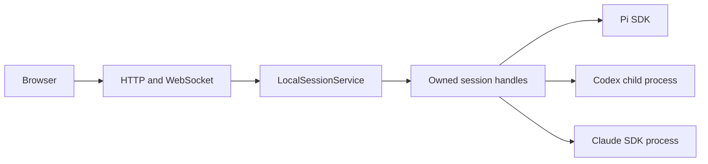

# Runtime and harness are separate axes

A **harness** selects which agent executes: Pi, native Codex, or native Claude. A **runtime** selects where it executes. Issue #92 implements the local multi-harness application first; a remote runner, ACP bridge, container manager, and runtime router are not prerequisites or shipping claims.

See [multi-harness-design.md](multi-harness-design.md) for the current implementation and [native-compatibility.md](native-compatibility.md) for capability/evidence boundaries. The earlier staged proposal in this file is superseded by the latest #92 direction.

## Current local implementation

The service owns web-ID lookup, one live-handle cache, admission, viewer/work leases, and disposal. It delegates operational behavior through the same `SessionHandle` for every harness. Pi resources, commands, projections, native extensions, and retry compatibility live inside its adapter. A Pi SDK test peer uses the same subscription/binding ingress; no mock browser broadcaster substitutes for the service.

The host adds realtime sequencing, browser activity decoration, unread state, browser UI metadata, and viewer sockets. The native binding file stores only web/native identity and display metadata; it is not a native session database or transcript. Pi UUIDs remain unchanged for existing extensions and orchestration.

`SessionServiceEvent` is the serialized boundary. Pi legacy events retain Pi-only fidelity; native ordered transcript events and request/resolved interactions use the shared DTOs. Browser fields must not depend on native SDK types, filesystem paths, or transport implementation details.

## Future runtime binding constraints

If a remote/container transport is added later:

- The same harness must preserve operations, capabilities, and behavior across transports. A capability flag cannot excuse transport drift.
- Runtime binding is explicit, server-owned metadata. Missing, conflicting, or unavailable bindings fail closed; they never execute against a different runtime.
- Session creation/open/disposal, interactions, event correlation, and restart recovery must traverse the same operational handle path. Do not introduce another raw-session factory or parallel event broadcaster.
- Credentials and native homes stay server-side in the relevant trust domain. Host filesystem/Git capabilities must not be confused with a native agent's sandbox.
- Host-owned metadata may be removed offline; deleting a native transcript requires an explicit supported native operation and truthful UI wording.

PR #119's transport work and #120's Pi projection/retry isolation remain reusable implementation material, not evidence of Pi-versus-native semantic parity. A future runner must earn its own in-process/transport conformance tests through production adapters. No universal runtime framework is introduced merely to reserve that possibility.
